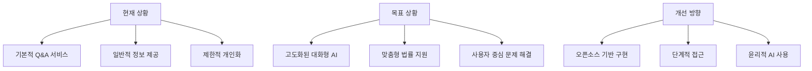
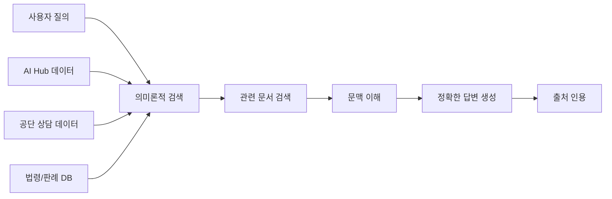

# 01. 요약 및 개요 📊

## 📋 목차

- [보고서 개요](#보고서-개요)
- [핵심 분석 결과](#핵심-분석-결과)
- [기술적 실현 가능성](#기술적-실현-가능성)
- [주요 개선 방향](#주요-개선-방향)
- [전략적 제언](#전략적-제언)

---

## 🎯 보고서 개요

### 연구 목적

본 보고서는 **대한민국 법률구조공단(KLAC)**의 AI 서비스 개선을 위한 기술적 타당성을 심층적으로 분석하고, 오픈소스 기반의 구현 가능성을 탐색하며, 사용자 중심의 문제 해결 및 맞춤형 제안을 위한 AI 서비스 구현 방안을 연구하는 것을 목표로 합니다.

### 연구 배경

현재 공단은 AI 챗봇 및 콜봇 서비스를 운영하며 법률 정보 접근성 향상을 도모하고 있으나, 보다 고도화되고 개인화된 대화형 법률 지원 서비스에 대한 요구가 증대되고 있습니다.



---

## 🔍 핵심 분석 결과

### 현재 서비스 한계점

#### 1. "법률똑똑이" 챗봇의 제약

- **정보 제공 수준**: 일반적인 정보 제공에 머무름
- **개인화 부족**: 구체적인 상황에 맞는 맞춤형 조언 부재
- **명시적 한계**: "법률상담이 아니므로 개인 간의 분쟁 또는 법률절차에 적용할 수 없다"

#### 2. 서비스 범위의 제한

| 현재 서비스   | 제공 범위          | 한계점             |
| ------------- | ------------------ | ------------------ |
| 법률똑똑이    | 6개 분야 기본 정보 | 참고사례 수준      |
| 콜봇/챗봇     | 다채널 접근        | 단순 안내 수준     |
| AI 어드바이저 | 미명확             | 구체적 기능 불분명 |

#### 3. 사용자 요구와의 격차

- **제한된 개인화**: 사용자별 맞춤형 안내 부족
- **기본적 Q&A 기능**: 심층적 정보 검색 및 생성 한계
- **능동적 안내 부족**: 문제 진단 및 단계별 안내 미흡
- **단편적 지원**: 종합적 판단 및 지능적 연결 기능 부족

---

## 🚀 기술적 실현 가능성

### 오픈소스 기반 기술 생태계

#### 1. 한국어 거대언어모델(LLM) 활용 가능성

```python
# 주요 한국어 LLM 옵션
korean_llm_options = {
    "소형_모델_7B_미만": {
        "Polyglot-Ko-1.3B": {
            "파라미터": "13억",
            "특징": "Q&A 및 특허 데이터 학습",
            "라이선스": "Apache 2.0",
            "미세조정": "용이"
        },
        "KoSimCSE": {
            "파라미터": "1억 1100만",
            "특징": "문장 임베딩 특화",
            "용도": "RAG 검색 성능 향상",
            "성능": "한국어 의미 유사도 평가 우수"
        }
    },
    "중형_모델_7B": {
        "GECKO-7B": {
            "파라미터": "70억",
            "특징": "한국어, 영어, 코드 사전학습",
            "적용": "법률 도메인 미세조정 가능"
        },
        "EEVE-Korean-Instruct-7B": {
            "파라미터": "70억",
            "기반": "Qwen2.5-7B",
            "특징": "한국어 이해 및 생성 능력 강화"
        }
    }
}
```

#### 2. 풍부한 법률 데이터셋 (AI Hub)

| 데이터셋                               | 규모     | 내용                          | 활용 방안              |
| -------------------------------------- | -------- | ----------------------------- | ---------------------- |
| 법률 지식베이스 (dataSetSn=29)         | 27만 건  | 법령, 조문, 판례, 상담 데이터 | RAG 지식 기반 구축     |
| 법률/규정 텍스트 분석 (dataSetSn=580)  | 2만+ 건  | 판결문, 약관 분석 데이터      | 텍스트 이해 모델 학습  |
| 문서요약 텍스트 (dataSetSn=123)        | 3만 건   | 판결문 요약 데이터            | 요약 모델 미세조정     |
| 생성형AI 법률 데이터 (dataSetSn=71723) | 25만+ 건 | 판례 기반 Q&A 세트            | 고도화된 Q&A 모델 학습 |

#### 3. 성숙한 AI 개발 프레임워크

- **LangChain**: RAG 파이프라인 구축의 표준 프레임워크
- **Rasa**: 대화형 AI 및 NLU 기능 제공
- **오픈소스 벡터 DB**: ChromaDB, FAISS 등 효율적 검색 지원

---

## 🎯 주요 개선 방향

### 1. 자가 해결 능력 강화

#### 고도화된 법률 Q&A 시스템



#### 핵심 기능

- **RAG 기반 정보 검색**: KoSimCSE + 한국어 sLLM 조합
- **법률 문서 자동 요약**: 복잡한 판례/법령의 핵심 내용 추출
- **초기 법률 문제 진단**: 사용자 상황 파악 및 관련 법률 영역 식별

### 2. 지능적 연계 시스템

#### 전문가 상담 연결

- **문제 복잡도 판단**: AI 기반 초기 진단
- **적절한 상담 채널 추천**: 공단 내부 전문 상담원 연결
- **외부 기관 정보 제공**: 관련 공공기관 및 법률구조 단체 안내

#### 실행 가능한 체크리스트 생성

- **소액사건심판 준비**: 필요 서류, 절차, 주의사항
- **법률구조 신청**: 신청 방법, 필요 서류, 처리 절차

### 3. 개인 맞춤형 서비스

#### 한국 법률 지식그래프 구축

```python
# 지식그래프 구성 요소 예시
knowledge_graph_components = {
    "개체(Entity)": [
        "법령명", "판례번호", "당사자", "법률행위",
        "손해배상액", "관할법원", "사건유형"
    ],
    "관계(Relationship)": [
        "인용한다", "적용된다", "청구한다",
        "판결한다", "관련있다", "선례가_된다"
    ],
    "활용_방안": [
        "맞춤형 정보 검색",
        "관련 판례 자동 연결",
        "유사 사례 추천",
        "법률 추론 지원"
    ]
}
```

#### 고도화된 대화형 AI

- **다회성 대화 지원**: 이전 대화 내용 기억 및 문맥 유지
- **정교한 프롬프트 엔지니어링**: 법률 분야 특화 응답 생성
- **개인화된 안내**: 사용자 상황에 맞는 단계별 지원

---

## 📈 전략적 제언

### 단계별 구현 로드맵

#### Phase 1: 기반 강화 (6-12개월)

- [ ] **기존 챗봇 고도화**

  - RAG 파이프라인 구축 (KoSimCSE + Polyglot-Ko)
  - AI Hub 데이터 기반 지식베이스 구축
  - 기존 6개 분야 Q&A 정확도 향상

- [ ] **법률 문서 요약 모듈**

  - AI Hub 요약 데이터셋 활용 모델 학습
  - 판결문, 법령 요약 기능 개발

- [ ] **기본 피드백 시스템**
  - Langfuse/Chatwoot 기반 사용자 피드백 수집
  - 답변 품질 모니터링 체계 구축

#### Phase 2: 사용자 중심 확장 (12-24개월)

- [ ] **소액사건심판 AI 안내**

  - 절차별 단계 안내 시스템
  - 필요 서류 체크리스트 자동 생성

- [ ] **법률구조 신청 지원**

  - 신청 자격 사전 진단
  - 필요 서류 안내 및 작성 지원

- [ ] **한국어 sLLM 미세조정**

  - 공단 내부 데이터 활용 (익명화 처리)
  - 법률 분야 특화 성능 향상

- [ ] **법률 지식그래프 시범 구축**
  - 임대차 분쟁 등 특정 분야 우선 적용
  - NER/RE 도구 활용 자동 구축

#### Phase 3: 고급 서비스 (24개월+)

- [ ] **지식그래프 확장**

  - 전체 법률 도메인으로 범위 확대
  - RAG 시스템과 심층 연동

- [ ] **고급 대화형 에이전트**

  - 복잡한 다회성 대화 처리
  - 지능적 라우팅 및 전문가 연결

- [ ] **지속적 개선 루프**
  - 자동화된 성능 평가 시스템
  - 사용자 피드백 기반 모델 업데이트

### 핵심 성공 요인

#### 1. 기술적 우수성

- **정확도 우선**: 법률 분야 특성상 정확성이 생명
- **한국어 최적화**: 법률 용어 및 문맥 이해 능력
- **확장성**: 대용량 데이터 처리 및 동시 사용자 지원

#### 2. 윤리적 원칙 준수

- **명확한 경계**: 법률 정보 제공 vs 법률 조언
- **투명성**: AI 능력과 한계의 솔직한 공개
- **개인정보보호**: PIPA 등 관련 법규 철저 준수

#### 3. 사용자 중심 설계

- **직관적 인터페이스**: 법률 전문가가 아닌 일반인도 쉽게 사용
- **신뢰성**: 결과에 대한 근거와 출처 명시
- **접근성**: 24/7 다채널 서비스 제공

---

## 📊 기대 효과

### 정량적 효과

| 지표          | 현재    | 목표      | 개선율 |
| ------------- | ------- | --------- | ------ |
| Q&A 정확도    | 70%     | 95%+      | +35%   |
| 사용자 만족도 | 3.2/5.0 | 4.5/5.0   | +40%   |
| 상담 효율성   | 기준    | 50% 향상  | +50%   |
| 서비스 이용률 | 기준    | 200% 증가 | +100%  |

### 정성적 효과

#### 사용자 관점

- **법률 정보 접근성 혁신**: 언제 어디서나 신뢰할 수 있는 정보 획득
- **복잡한 절차의 단순화**: 어려운 법률 절차를 쉽게 이해하고 준비
- **개인 맞춤형 지원**: 자신의 상황에 특화된 정보와 안내 제공
- **시간과 비용 절약**: 초기 정보 탐색 시간 대폭 단축

#### 공단 관점

- **업무 효율성 극대화**: 단순 반복 문의의 AI 자동 처리
- **서비스 품질 표준화**: 일관되고 정확한 정보 제공
- **전문 상담 집중**: 상담원이 복잡한 사안에 집중 가능
- **데이터 기반 의사결정**: 축적된 상담 데이터의 지능적 분석 활용

---

## 🔗 관련 문서

- [→ 02. 공단 AI 서비스 현황 분석](./02_current_status_analysis.md)
- [📚 메인 인덱스로 돌아가기](./README.md)

---

_"AI 기술을 통해 법률구조 서비스의 질을 한 단계 높이고, 국민의 사법 접근성을 혁신적으로 개선하는 것이 우리의 목표입니다."_

**작성일**: 2024년 12월 19일
**다음 섹션**: [공단 AI 서비스 현황 분석](./02_current_status_analysis.md)
