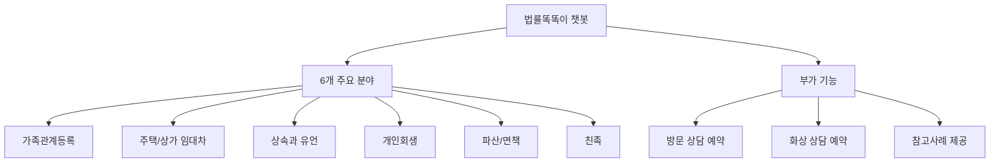
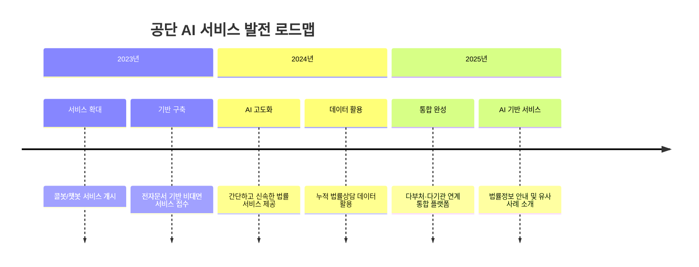
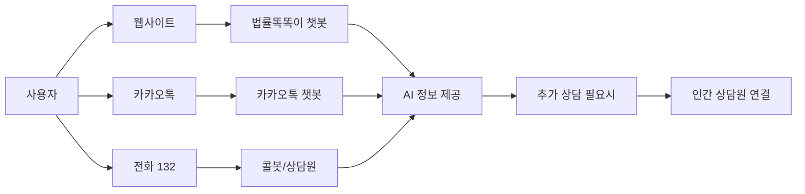
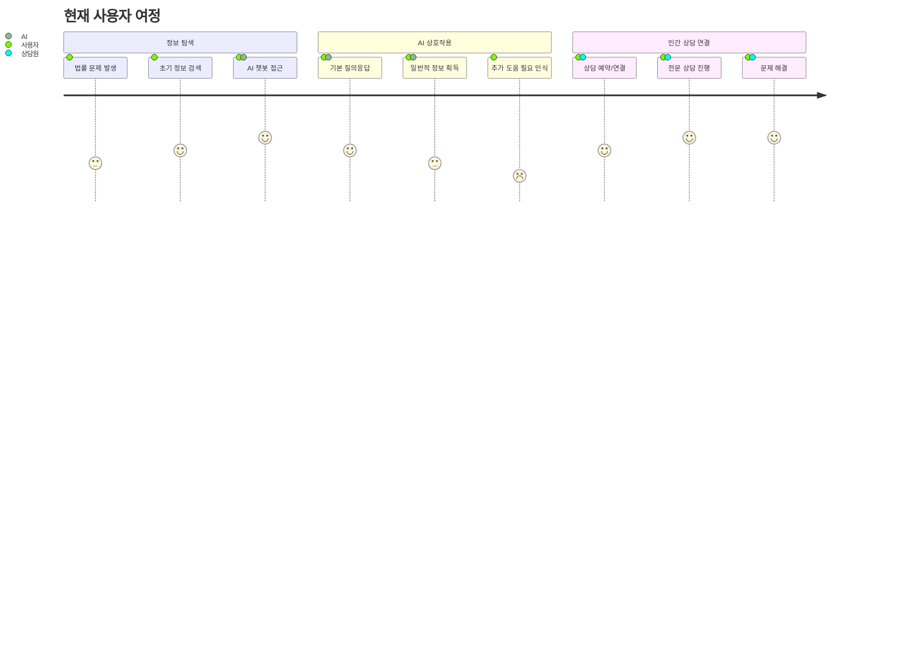
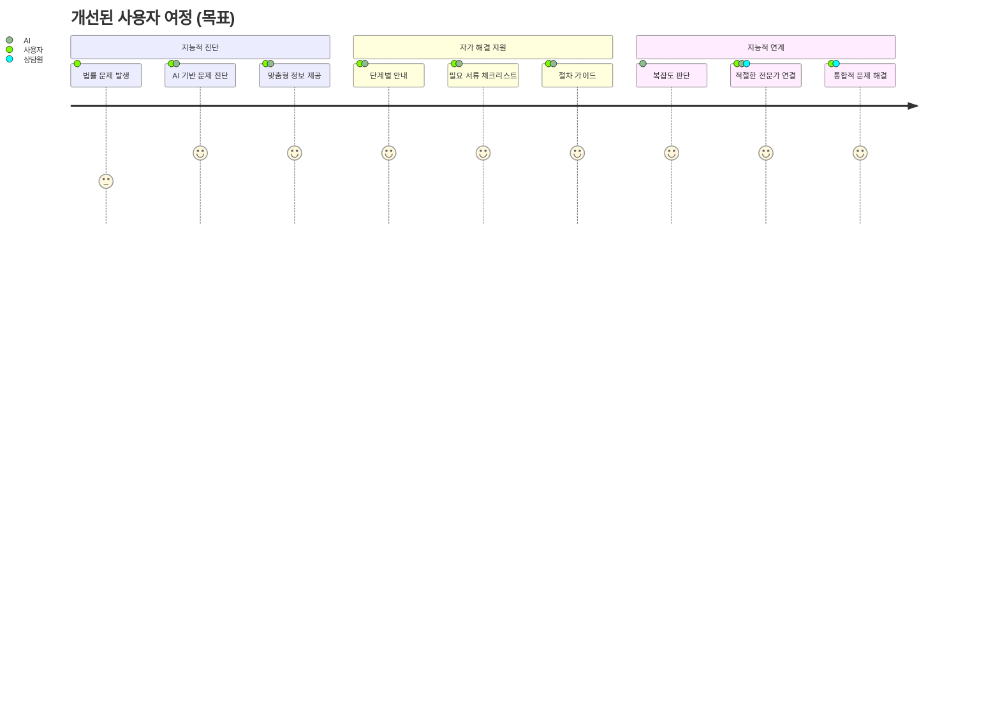
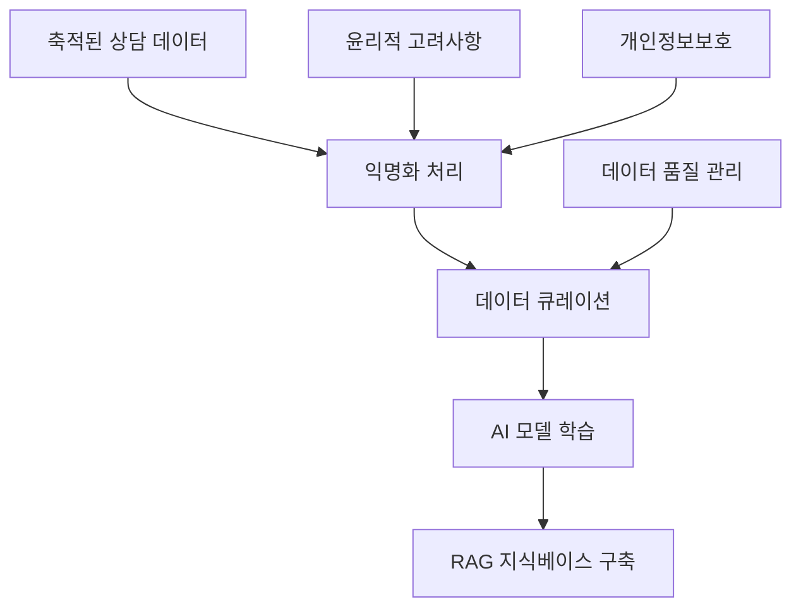

# 02. 공단 AI 서비스 현황 분석 🏛️

## 📋 목차

- [기존 AI 이니셔티브 개요](#기존-ai-이니셔티브-개요)
- [사용자 상호작용 지점](#사용자-상호작용-지점)
- [서비스 제공 방식 분석](#서비스-제공-방식-분석)
- [격차 및 개선 영역](#격차-및-개선-영역)
- [통합 플랫폼 비전](#통합-플랫폼-비전)

---

## 🎯 기존 AI 이니셔티브 개요

대한법률구조공단은 국민의 법률 서비스 접근성 강화를 목표로 AI 기술 도입을 점진적으로 추진해왔습니다. 현재 운영 중이거나 계획 단계에 있는 다양한 AI 기반 서비스를 분석해보겠습니다.

### 1. "법률똑똑이" 챗봇 📱

#### 서비스 개요



#### 주요 특징

- **서비스 범위**: 특정 법률 분야에 대한 정보 제공
- **기능**: Q&A 기반 정보 검색 및 상담 예약 지원
- **접근 방식**: 웹사이트 기반 챗봇 인터페이스

#### 현재 한계점

| 측면          | 현재 상태     | 한계점                 |
| ------------- | ------------- | ---------------------- |
| **정보 수준** | 참고사례 제공 | 일반적 정보에 국한     |
| **개인화**    | 표준화된 답변 | 개별 상황 미반영       |
| **법적 효력** | 명시적 면책   | "법률상담이 아님" 명시 |
| **적용 범위** | 6개 분야 제한 | 전체 법률 영역 미커버  |

#### 면책 조항 분석

> "법률 질의에 대한 참고사례를 제공한 것으로 정확한 법률이 적용된 법률상담이 아니므로 개인 간의 분쟁 또는 법률절차에 적용할 수 없다"

**시사점**: 현재 서비스가 정보 제공에 초점을 맞추고 있으며, 개인의 구체적인 상황에 맞는 맞춤형 법률 조언과는 거리가 있음을 보여줍니다.

### 2. 콜봇 및 일반 챗봇 서비스 📞

#### 서비스 확장 현황

- **도입 시기**: 2023년 12월 확대 개시
- **접근 채널**:
  - 대표번호 132를 통한 전화 상담
  - 카카오톡 채널을 통한 챗봇 서비스
- **목적**: 법률 서비스 이용 편의성 향상

#### 기술적 특징 분석

```python
# 현재 콜봇/챗봇 서비스 구조 추정
current_service_structure = {
    "채널": {
        "전화": "대표번호 132 콜봇",
        "메신저": "카카오톡 채널 챗봇",
        "웹": "법률똑똑이 웹 챗봇"
    },
    "기능_수준": {
        "정보_제공": "기본적 Q&A",
        "상담_연결": "인간 상담원 연결",
        "예약_지원": "방문/화상 상담 예약"
    },
    "한계점": {
        "대화_깊이": "단순 질의응답 수준",
        "문맥_이해": "제한적",
        "개인화": "미흡"
    }
}
```

#### 개선 필요 영역

- **대화형 AI 기능**: 현재 기본적인 질의응답 수준
- **복잡성 처리**: 사용자 질의의 다양성과 복잡성 처리 한계
- **개인화 지원**: 개인화된 지원 제공 능력 부족

### 3. AI 어드바이저 서비스 🤖

#### 현재 상태

- **언급 수준**: 콜봇, 챗봇과 함께 언급
- **구체적 정보**: 기능이나 역할에 대한 상세 정보 부족
- **추정 역할**: 단순 정보 제공을 넘어선 안내 또는 조언 기능 목표

#### 발전 가능성

명칭으로 미루어 볼 때, 향후 개선 방향에서 중요한 역할을 할 수 있는 서비스로 판단됩니다.

### 4. 통합 플랫폼 비전 🌐

#### 2023-2025 추진 계획



#### 핵심 구성 요소

1. **전자문서 기반 비대면 법률구조 서비스 접수**
2. **누적된 법률상담 데이터를 활용한 AI 기반 법률정보 안내**
3. **유사 사례 소개 기능**
4. **다부처·다기관 연계를 통한 통합 플랫폼 서비스**

#### 전략적 의미

- 본 보고서 제안 방향과 일치하는 장기적 비전
- "누적된 법률상담 데이터" 활용 계획은 고품질 한국어 법률 AI 모델 학습의 핵심 자산

---

## 👥 사용자 상호작용 지점

### 현재 서비스 접점 분석

#### 1. 정보 접근 채널



#### 2. 상담 방식 다양화

| 상담 방식       | 특징                 | AI 활용도 | 개선 가능성       |
| --------------- | -------------------- | --------- | ----------------- |
| **AI 챗봇**     | 24/7 접근, 즉시 응답 | 높음      | 고도화 필요       |
| **사무실 내방** | 면대면 상담          | 낮음      | AI 사전 준비 지원 |
| **사이버 상담** | 온라인 텍스트 상담   | 중간      | AI 보조 도구 활용 |
| **채팅 상담**   | 실시간 텍스트 상담   | 중간      | AI 상담원 지원    |
| **전화 상담**   | 음성 기반 상담       | 중간      | 콜봇 고도화       |

### 사용자 여정 분석

#### 현재 사용자 여정



#### 개선된 사용자 여정 (목표)



---

## 🔍 서비스 제공 방식 분석

### 현재 AI 역할 분석

#### 1. 자가 해결 도구로서의 AI

- **주요 기능**: 사용자가 스스로 정보를 찾아볼 수 있도록 지원
- **정보 수준**: 참고 사례 수준의 일반적 정보
- **한계**: 법적 분쟁 해결에 직접 적용 불가

#### 2. 게이트웨이 역할

- **1차 접점**: AI가 초기 정보 탐색 단계에서 활용
- **연결 기능**: 복잡하거나 개인화된 지원 필요 시 인간 상담원 연결
- **효율성**: 단순 반복 문의 처리를 통한 상담원 업무 부담 경감

### 현재 서비스 구조의 강점과 약점

#### 강점 💪

- **다채널 접근**: 웹, 모바일, 전화 등 다양한 접점 제공
- **24/7 가용성**: AI 기반 서비스의 상시 접근 가능
- **기본 인프라**: 챗봇 및 콜봇 기반 기술 인프라 구축
- **데이터 축적**: 지속적인 상담 데이터 축적

#### 약점 🔍

- **제한적 지능**: 기본적인 키워드 매칭 수준의 응답
- **문맥 이해 부족**: 복잡한 법률 상황의 맥락적 이해 한계
- **개인화 미흡**: 사용자별 맞춤형 정보 제공 부족
- **능동적 안내 부족**: 문제 해결을 위한 단계별 가이드 미흡

---

## 📊 격차 및 개선 영역

### 사용자 질의 기반 파악된 격차

#### 1. 제한된 개인화 수준

```python
# 현재 vs 목표 개인화 수준
personalization_gap = {
    "현재": {
        "정보_제공": "일반적 법률 정보",
        "응답_방식": "표준화된 답변",
        "사용자_고려": "최소한의 기본 정보"
    },
    "목표": {
        "정보_제공": "사용자 상황별 맞춤 정보",
        "응답_방식": "개인화된 단계별 안내",
        "사용자_고려": "종합적 상황 분석 및 반영"
    },
    "개선_방안": [
        "사용자 프로파일링 시스템",
        "상황별 맞춤 정보 제공",
        "대화 기록 기반 문맥 이해"
    ]
}
```

#### 2. 기본적인 Q&A 기능의 한계

- **현재**: 단순 키워드 매칭 기반 검색
- **필요**: 검색 증강 생성(RAG) 기반 심층 정보 검색
- **개선 방향**: 의미론적 검색 + 생성형 AI 조합

#### 3. 능동적 안내 부족

| 현재 상태       | 개선 필요 영역 | 목표 상태          |
| --------------- | -------------- | ------------------ |
| 수동적 응답     | 문제 진단 능력 | 능동적 문제 파악   |
| 단편적 정보     | 절차 안내      | 단계별 가이드 제공 |
| 일회성 상호작용 | 지속적 지원    | 문제 해결까지 동반 |

#### 4. 단편적인 지원 경로

- **현재**: 단순한 상담 채널 안내
- **필요**: 지능적 라우팅 시스템
- **개선 방향**:
  - 문제 유형별 최적 상담원 연결
  - 외부 유관기관 정보 제공
  - 종합적 상황 판단 기반 안내

### 데이터 활용 잠재력

#### 현재 상황

- **보유 자산**: 방대한 양의 법률 상담 데이터 축적
- **활용 수준**: AI 서비스 고도화에 충분히 활용되지 않음
- **잠재력**: 고도로 특화된 한국어 법률 AI 모델 학습 가능

#### 개선 방안



---

## 🌐 통합 플랫폼 비전

### 2023-2025 전략적 목표

#### 핵심 구성 요소

1. **전자문서 기반 비대면 서비스**

   - 온라인 신청 및 접수 시스템
   - 디지털 서류 처리 자동화
   - 비대면 상담 인프라 구축

2. **AI 기반 법률정보 안내**

   - 누적 상담 데이터 활용
   - 유사 사례 자동 매칭
   - 개인화된 정보 제공

3. **다부처·다기관 연계**
   - 통합 플랫폼 서비스 구현
   - 원스톱 법률 서비스 제공
   - 기관 간 정보 공유 체계

### 본 보고서 제안과의 연계성

#### 시너지 효과

- **데이터 활용**: 누적 상담 데이터의 AI 학습 활용
- **서비스 고도화**: RAG 시스템 및 지식그래프 구축
- **통합 접근**: 다채널 서비스의 일관된 AI 지원

#### 가속화 방안

본 보고서에서 제안하는 오픈소스 기반 기술들은 공단의 통합 플랫폼 전략을 구체화하고 가속화하는 데 기여할 수 있습니다.

---

## 📈 개선 우선순위

### 단기 개선 과제 (6-12개월)

1. **기존 챗봇 성능 향상**

   - RAG 파이프라인 도입
   - 답변 정확도 개선
   - 사용자 피드백 시스템 구축

2. **데이터 기반 강화**
   - AI Hub 데이터 통합
   - 내부 데이터 익명화 및 활용
   - 지식베이스 구축

### 중기 개선 과제 (12-24개월)

1. **개인화 서비스 도입**

   - 사용자 프로파일링
   - 맞춤형 정보 제공
   - 대화 기록 기반 문맥 이해

2. **지능적 연계 시스템**
   - 문제 진단 알고리즘
   - 최적 상담원 매칭
   - 외부 기관 연계

### 장기 개선 과제 (24개월+)

1. **고급 AI 서비스**
   - 법률 지식그래프 구축
   - 예측적 법률 지원
   - 완전 자동화된 절차 안내

---

## 🔗 관련 문서

- [← 01. 요약 및 개요](./01_executive_summary.md)
- [→ 03. 오픈소스 기반 기술적 타당성](./03_technical_feasibility.md)
- [📚 메인 인덱스로 돌아가기](./README.md)

---

_"현재 서비스의 한계를 정확히 파악하고, 사용자 중심의 개선 방향을 설정하는 것이 성공적인 AI 서비스 혁신의 첫걸음입니다."_

**작성일**: 2024년 12월 19일
**다음 섹션**: [오픈소스 기반 기술적 타당성](./03_technical_feasibility.md)
