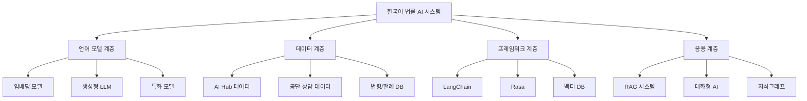
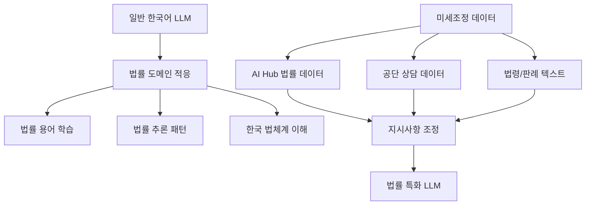
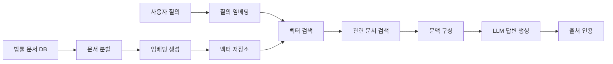
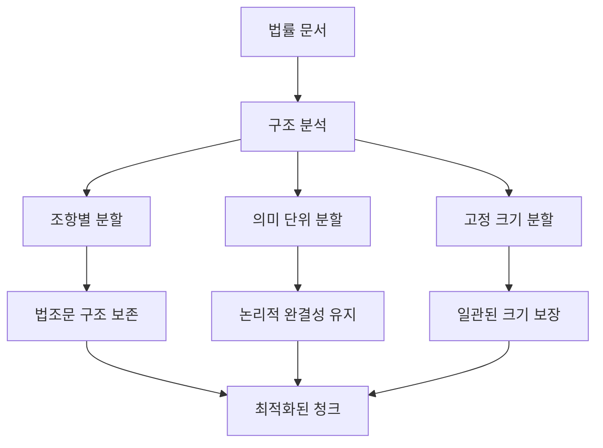
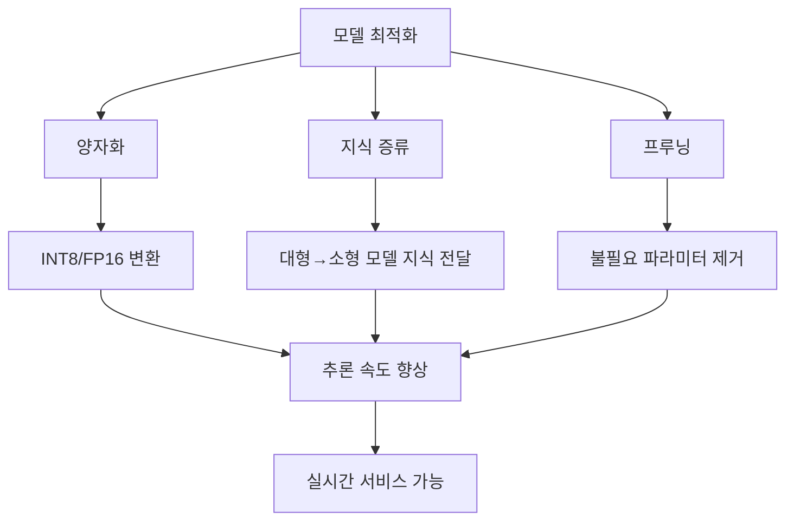

# 03. 오픈소스 기반 기술적 타당성 🔧

## 📋 목차

- [한국어 법률 AI 기술 스택](#한국어-법률-ai-기술-스택)
- [한국어 거대언어모델(LLM) 분석](#한국어-거대언어모델llm-분석)
- [법률 데이터셋 및 말뭉치](#법률-데이터셋-및-말뭉치)
- [RAG 프레임워크 및 검색 기술](#rag-프레임워크-및-검색-기술)
- [기술적 구현 전략](#기술적-구현-전략)

---

## 🚀 한국어 법률 AI 기술 스택

공단 AI 서비스의 사용자 중심적 개선은 오픈소스 기술을 적극적으로 활용함으로써 기술적 타당성을 확보할 수 있습니다. 한국어 자연어 처리(NLP) 기술의 발전, 풍부한 법률 데이터셋의 가용성, 그리고 고도화된 AI 개발 프레임워크의 등장이 이러한 개선을 뒷받침하는 핵심 요소입니다.

### 기술 생태계 개요



---

## 🤖 한국어 거대언어모델(LLM) 분석

### 1. 소형 언어 모델 (sLLM) - 7B 미만

#### KoSimCSE 계열 (문장 임베딩 특화)

```python
# KoSimCSE 모델 특성 분석
kosimcse_models = {
    "daekeun-ml/KoSimCSE-supervised-roberta-base": {
        "파라미터": "1억 1100만",
        "특징": "지도 학습 기반 문장 임베딩",
        "용도": "RAG 시스템 검색 성능 향상",
        "장점": [
            "한국어 의미 유사도 평가 우수",
            "NLI 데이터셋 기반 미세조정 가능",
            "상대적으로 작은 크기로 효율적"
        ],
        "법률_적용": "법률 문서 검색의 핵심 구성요소"
    },
    "BM-K/KoSimCSE-roberta": {
        "파라미터": "1억 1100만",
        "성능": "한국어 의미 유사도 평가 높은 성능",
        "활용": "RAG 파이프라인의 검색 구성요소"
    }
}
```

**법률 분야 적용 가능성**:

- RAG 시스템의 검색(retrieval) 구성요소 구축에 필수적
- 법률 문서 간 의미적 유사도 계산에 특화
- 상대적으로 작은 크기로 실시간 검색 성능 보장

#### Polyglot-Ko 계열 (다목적 한국어 모델)

```python
# Polyglot-Ko 모델 분석
polyglot_ko_models = {
    "EleutherAI/polyglot-ko-1.3b": {
        "파라미터": "13억",
        "학습_데이터": "Q&A 및 특허 데이터 포함",
        "라이선스": "Apache 2.0",
        "미세조정": "용이함",
        "장점": [
            "다양한 한국어 텍스트 학습",
            "Q&A 형태 데이터 경험",
            "법률 도메인 미세조정 적합"
        ]
    },
    "EleutherAI/polyglot-ko-5.8b": {
        "파라미터": "58억",
        "성능": "더 높은 언어 이해 능력",
        "자원_요구": "더 많은 계산 자원 필요"
    }
}
```

**미세조정 전략**:

- 법률 분야 특수성을 위한 도메인 특화 미세조정 필수
- AI Hub 법률 Q&A 데이터셋을 활용한 지시사항 조정
- 공단 내부 상담 데이터(익명화 처리) 활용 가능

### 2. 중형 언어 모델 (7B 급)

#### 지시사항 조정 모델들

```python
# 7B 급 한국어 LLM 옵션
medium_llm_options = {
    "kifai/GECKO-7B": {
        "파라미터": "70억",
        "특징": "한국어, 영어, 코드 사전학습",
        "적용": "법률 도메인 미세조정 가능",
        "장점": "다국어 지원으로 국제법 대응 가능"
    },
    "yanolja/EEVE-Korean-Instruct-7B-v2.0": {
        "파라미터": "70억",
        "기반": "Qwen2.5-7B",
        "특징": "한국어 이해 및 생성 능력 강화",
        "용도": "대화형 AI 및 복잡한 질의응답"
    },
    "OLAIR/ko-r1-7b-v2.0.3": {
        "파라미터": "76.1억",
        "기반": "Qwen2",
        "특징": "추론 능력 중점",
        "법률_적용": "복잡한 법률 추론 작업에 적합"
    }
}
```

### 3. 미세조정 고려사항

#### 법률 분야 특화 요구사항



#### 기술적 도전과제

| 도전과제           | 설명                             | 해결 방안                     |
| ------------------ | -------------------------------- | ----------------------------- |
| **법률 용어 이해** | 전문적이고 정확한 법률 용어 처리 | 법률 말뭉치 기반 어휘 확장    |
| **문맥 의존성**    | 법률 문서의 복잡한 문맥 관계     | 긴 문맥 처리 가능한 모델 선택 |
| **정확성 요구**    | 법률 분야의 높은 정확성 기준     | RAG 시스템과 결합한 사실 검증 |
| **자원 요구량**    | 미세조정에 필요한 계산 자원      | 효율적인 미세조정 기법 적용   |

---

## 📊 법률 데이터셋 및 말뭉치

### AI Hub 법률 데이터셋 상세 분석

#### 1. 법률 지식베이스 (dataSetSn=29)

```python
# 법률 지식베이스 데이터셋 구성
legal_knowledge_base = {
    "총_규모": "27만 건",
    "구성_요소": {
        "법령": "현행 법령 및 조문",
        "판례": "대법원 및 각급 법원 판례",
        "법률_상담": "실제 상담 사례 데이터",
        "생활법령": "Q&A 형식 생활법령 정보"
    },
    "활용_방안": {
        "RAG_지식베이스": "검색 증강 생성 시스템의 핵심 데이터",
        "Q&A_모델_학습": "질의응답 모델 미세조정",
        "법률_용어_사전": "도메인 특화 어휘 구축"
    },
    "품질_특성": {
        "신뢰성": "공신력 있는 법률 정보",
        "구조화": "체계적으로 분류된 데이터",
        "최신성": "정기적 업데이트 가능"
    }
}
```

#### 2. 법률/규정 텍스트 분석 데이터 (dataSetSn=580)

```python
# 판결서 및 약관 분석 데이터
legal_text_analysis = {
    "판결문_데이터": {
        "규모": "1만+ 건",
        "유형": ["민사", "형사", "행정"],
        "태깅_정보": [
            "사실관계 추출",
            "당사자 주장 분석",
            "법원 판단 요약",
            "적용 법조문"
        ]
    },
    "약관_데이터": {
        "규모": "1만+ 건",
        "분석_요소": [
            "약관 조항별 분류",
            "유불리 판단",
            "소비자 보호 관점",
            "법적 효력 분석"
        ]
    },
    "활용_가치": {
        "텍스트_이해": "법률 문서 구조 학습",
        "요약_모델": "판결문 요약 기능 개발",
        "논증_추출": "법적 추론 패턴 학습"
    }
}
```

#### 3. 문서요약 텍스트 데이터 (dataSetSn=123)

- **규모**: 3만 건의 법원 판결문
- **구성**: 추출 요약(3문장) + 생성 요약문
- **활용**: 법률 문서 요약 모델 학습 및 미세조정

#### 4. 생성형AI 법률 데이터 (dataSetSn=71723)

```python
# 고도화된 법률 Q&A 데이터셋
advanced_legal_qa = {
    "상황별_판례": {
        "규모": "25만 건",
        "특징": "실제 상황과 관련 판례 매칭",
        "구성": "상황 설명 + 관련 판례 + 추출 요약"
    },
    "Q&A_세트": {
        "AI_생성": "7만 784건",
        "전문가_생성": "2만 160건",
        "품질": "전문가 검증 완료"
    },
    "활용_전략": {
        "RAG_시스템": "방대한 규모의 지식베이스 구축",
        "Q&A_모델": "고품질 질의응답 모델 학습",
        "상황_매칭": "사용자 상황별 판례 추천"
    }
}
```

#### 5. 법률 지식기반 관계 데이터 (dataSetSn=71722)

- **특화 분야**: 세법 중심
- **구성**: 3만 9,035건의 트리플 라벨링 (주체-관계-객체)
- **활용**: 한국 법률 지식그래프 구축의 방법론적 기반

### 추가 데이터 자원

#### KoNLPy 말뭉치

```python
# KoNLPy 법률 관련 말뭉치
konlpy_legal_corpus = {
    "kolaw": {
        "내용": "대한민국 헌법 텍스트",
        "라이선스": "GPL",
        "활용": "기본 법률 언어 모델 학습"
    },
    "kobill": {
        "내용": "국회 의안 텍스트",
        "라이선스": "GPL",
        "활용": "입법 과정 및 법안 분석"
    }
}
```

---

## 🔍 RAG 프레임워크 및 검색 기술

### 1. LangChain 기반 RAG 파이프라인

#### 핵심 구성요소

```python
# LangChain RAG 파이프라인 구성
langchain_rag_pipeline = {
    "문서_로더": {
        "지원_형식": ["PDF", "웹", "텍스트", "JSON"],
        "법률_문서": "판례, 법령, 상담 사례",
        "전처리": "메타데이터 추출 및 구조화"
    },
    "텍스트_분할": {
        "방식": ["문자 기반", "재귀적", "의미 기반"],
        "법률_특화": "조항, 항, 목 단위 분할",
        "청크_크기": "법률 문서 특성에 맞는 최적화"
    },
    "임베딩_모델": {
        "추천": "KoSimCSE 계열",
        "특징": "한국어 의미 유사도 특화",
        "성능": "법률 용어 이해도 높음"
    },
    "벡터_저장소": {
        "옵션": ["ChromaDB", "FAISS", "Pinecone"],
        "선택_기준": "확장성, 성능, 비용",
        "인덱싱": "효율적인 유사도 검색"
    }
}
```

#### RAG 파이프라인 아키텍처



### 2. 고급 검색 기술

#### 하이브리드 검색 (밀집 + 희소)

```python
# 하이브리드 검색 전략
hybrid_search_strategy = {
    "밀집_검색": {
        "모델": "KoSimCSE",
        "장점": "의미론적 유사도 이해",
        "적용": "복잡한 법률 개념 검색"
    },
    "희소_검색": {
        "방식": "BM25",
        "장점": "정확한 법률 용어 매칭",
        "적용": "특정 조문, 판례번호 검색"
    },
    "융합_방법": {
        "RRF": "Reciprocal Rank Fusion",
        "가중치": "도메인별 최적화",
        "성능": "단일 방식 대비 향상"
    }
}
```

#### 재순위화 (Re-ranking)

- **모델**: ko-reranker-8k (한국어 특화)
- **기능**: 초기 검색 결과의 관련성 향상
- **적용**: 법률 문서의 정확한 우선순위 결정

### 3. 법률 특화 검색 최적화

#### 분할(Chunking) 전략



#### 메타데이터 활용

```python
# 법률 문서 메타데이터 구조
legal_document_metadata = {
    "법령": {
        "법령명": "민법",
        "조항": "제750조",
        "시행일": "2024-01-01",
        "관련_키워드": ["손해배상", "불법행위"]
    },
    "판례": {
        "사건번호": "2023다12345",
        "법원": "대법원",
        "판결일": "2024-03-15",
        "사건유형": "손해배상",
        "핵심_쟁점": ["과실 인정", "손해액 산정"]
    },
    "활용": {
        "필터링": "관련 법령/판례만 검색",
        "가중치": "최신성, 관련성 반영",
        "추천": "유사 사건 자동 추천"
    }
}
```

---

## 🛠️ 기술적 구현 전략

### 1. 단계별 기술 도입 계획

#### Phase 1: 기반 RAG 시스템 구축

```python
# Phase 1 기술 스택
phase1_tech_stack = {
    "임베딩_모델": "KoSimCSE-roberta-base",
    "생성_모델": "Polyglot-Ko-1.3B (미세조정)",
    "벡터_DB": "ChromaDB",
    "프레임워크": "LangChain",
    "데이터": "AI Hub 법률 지식베이스",
    "목표": {
        "Q&A_정확도": "85% 이상",
        "응답_시간": "3초 이내",
        "동시_사용자": "100명"
    }
}
```

#### Phase 2: 고도화 및 확장

```python
# Phase 2 기술 업그레이드
phase2_upgrades = {
    "하이브리드_검색": "BM25 + KoSimCSE + RRF",
    "재순위화": "ko-reranker-8k 도입",
    "생성_모델": "EEVE-Korean-Instruct-7B",
    "지식그래프": "Neo4j 기반 법률 KG",
    "대화_관리": "LangChain Memory 시스템",
    "목표": {
        "Q&A_정확도": "95% 이상",
        "개인화_수준": "사용자별 맞춤 응답",
        "복잡_질의": "다회성 대화 지원"
    }
}
```

### 2. 성능 최적화 전략

#### 모델 최적화



#### 인프라 최적화

- **캐싱 전략**: 자주 검색되는 법률 정보 캐싱
- **로드 밸런싱**: 다중 모델 인스턴스 운영
- **GPU 활용**: 효율적인 GPU 메모리 관리

### 3. 품질 보증 체계

#### 정확성 검증

```python
# 품질 보증 프레임워크
quality_assurance = {
    "자동_평가": {
        "RAGAS": "RAG 시스템 전용 평가 메트릭",
        "BLEU/ROUGE": "텍스트 생성 품질",
        "Semantic_Similarity": "의미적 유사도"
    },
    "인간_평가": {
        "법률_전문가": "법적 정확성 검증",
        "사용자_테스트": "실제 사용성 평가",
        "A/B_테스트": "모델 성능 비교"
    },
    "지속_모니터링": {
        "실시간_피드백": "사용자 만족도 추적",
        "오류_탐지": "부정확한 답변 자동 감지",
        "성능_지표": "응답 시간, 정확도 모니터링"
    }
}
```

### 4. 확장성 고려사항

#### 수평적 확장

- **마이크로서비스 아키텍처**: 각 기능별 독립적 확장
- **API 게이트웨이**: 통합된 서비스 접점 제공
- **컨테이너화**: Docker/Kubernetes 기반 배포

#### 수직적 확장

- **모델 업그레이드**: 더 큰 모델로의 점진적 전환
- **기능 확장**: 새로운 법률 분야 추가
- **데이터 확장**: 지속적인 학습 데이터 보강

---

## 📊 기술적 위험 요소 및 대응 방안

### 주요 위험 요소

| 위험 요소            | 영향도  | 발생 확률 | 대응 방안               |
| -------------------- | ------- | --------- | ----------------------- |
| **AI 환각 현상**     | 🔴 높음 | 🟡 중간   | RAG 시스템 + 사실 검증  |
| **한국어 처리 한계** | 🟡 중간 | 🟡 중간   | 도메인 특화 미세조정    |
| **법률 용어 오해석** | 🔴 높음 | 🟢 낮음   | 전문가 검증 + 용어 사전 |
| **성능 병목**        | 🟡 중간 | 🟡 중간   | 최적화 + 인프라 확장    |

### 대응 전략

```python
# 위험 완화 전략
risk_mitigation = {
    "기술적_대응": {
        "환각_방지": "RAG + 출처 인용 + 신뢰도 점수",
        "성능_보장": "캐싱 + 로드밸런싱 + 모델 최적화",
        "정확성_확보": "다단계 검증 + 전문가 리뷰"
    },
    "운영적_대응": {
        "모니터링": "실시간 성능 추적",
        "백업": "다중 모델 운영",
        "업데이트": "점진적 모델 개선"
    }
}
```

---

## 🔗 관련 문서

- [← 02. 공단 AI 서비스 현황 분석](./02_current_status_analysis.md)
- [→ 04. 사용자 중심 문제 해결 전략](./04_user_centric_solutions.md)
- [📚 메인 인덱스로 돌아가기](./README.md)

---

_"오픈소스 기반의 한국어 법률 AI 기술은 충분히 성숙했으며, 체계적인 접근을 통해 공단의 서비스 혁신을 실현할 수 있습니다."_

**작성일**: 2024년 12월 19일
**다음 섹션**: [사용자 중심 문제 해결 전략](./04_user_centric_solutions.md)
