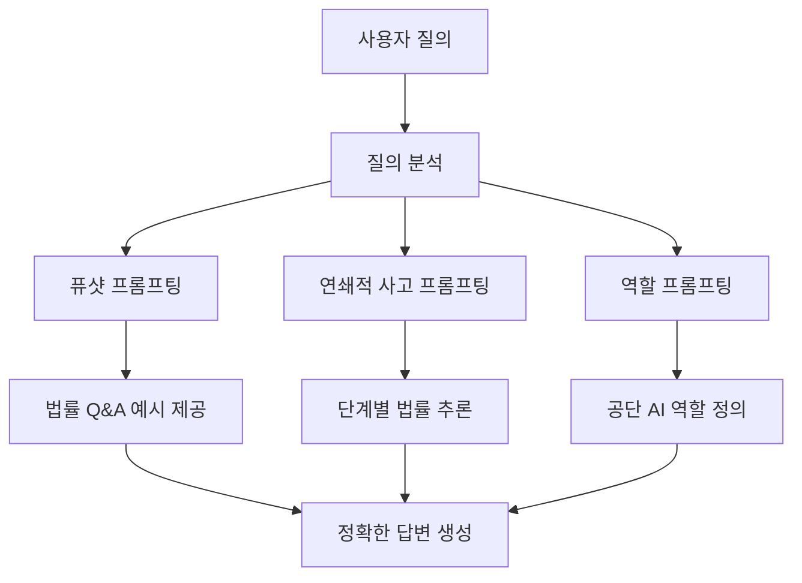
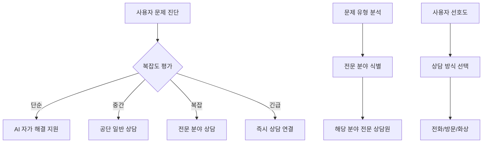
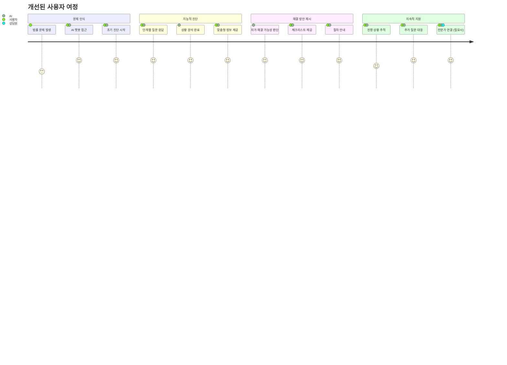

# 04. 사용자 중심 문제 해결 전략 👥

## 📋 목차

- [자가 해결 능력 강화](#자가-해결-능력-강화)
- [외부 및 인적 지원 연계](#외부-및-인적-지원-연계)
- [AI 기반 소송 지원](#ai-기반-소송-지원)
- [사용자 여정 최적화](#사용자-여정-최적화)

---

## 🎯 자가 해결 능력 강화

### 1. 고도화된 법률 Q&A 시스템

#### RAG 기반 정보 검색 시스템

```python
# 고도화된 Q&A 시스템 구조
enhanced_qa_system = {
    "검색_단계": {
        "의미론적_검색": "KoSimCSE 기반 벡터 검색",
        "키워드_검색": "BM25 기반 정확한 용어 매칭",
        "하이브리드_융합": "RRF를 통한 결과 통합"
    },
    "생성_단계": {
        "문맥_구성": "검색된 문서들의 관련 부분 추출",
        "답변_생성": "미세조정된 한국어 sLLM 활용",
        "출처_인용": "답변 근거 명시 및 신뢰도 제공"
    },
    "품질_보증": {
        "사실_검증": "다중 소스 교차 확인",
        "법률_용어": "전문 용어 사전 참조",
        "최신성_확인": "법령 개정 사항 반영"
    }
}
```

#### 프롬프트 엔지니어링 전략



### 2. 자동 법률 문서 요약

#### 요약 모델 구현

- **데이터**: AI Hub 법률 문서 요약 데이터셋 (3만 건)
- **모델**: Polyglot-Ko 또는 SOLAR mini 미세조정
- **기능**: 판례, 법령, 복잡한 법률 해설의 핵심 내용 추출

#### 요약 유형별 전략

| 문서 유형     | 요약 방식        | 핵심 요소             |
| ------------- | ---------------- | --------------------- |
| **판결문**    | 3문장 추출 요약  | 사실관계, 쟁점, 판단  |
| **법령**      | 조항별 핵심 내용 | 적용 대상, 요건, 효과 |
| **상담 사례** | 문제-해결 구조   | 상황, 적용 법리, 결론 |

### 3. 초기 법률 문제 진단

#### 대화형 진단 시스템

```python
# 법률 문제 진단 프로세스
legal_diagnosis_process = {
    "1단계_기본정보": {
        "질문": ["문제 유형", "당사자 관계", "발생 시기"],
        "목적": "기본적인 법률 영역 식별"
    },
    "2단계_상세분석": {
        "질문": ["구체적 상황", "관련 증거", "원하는 결과"],
        "목적": "세부 법률 쟁점 파악"
    },
    "3단계_진단결과": {
        "제공정보": [
            "관련 법률 분야",
            "예상 절차",
            "필요 서류",
            "해결 방안 옵션"
        ]
    }
}
```

#### 진단 결과 활용

- **자가 해결 가능**: 관련 정보 및 절차 안내 제공
- **전문가 상담 필요**: 적절한 상담 채널 추천
- **긴급 상황**: 즉시 대응 가능한 방안 안내

---

## 🤝 외부 및 인적 지원 연계

### 1. 지능적 라우팅 시스템

#### 상담 채널 매칭 알고리즘



#### 외부 기관 연계

```python
# 외부 기관 정보 데이터베이스
external_organizations = {
    "법률구조기관": {
        "대한변협": "변호사 상담 서비스",
        "시민단체": "특정 분야 법률 지원",
        "공익법무관": "공공기관 법률 서비스"
    },
    "전문기관": {
        "소비자분쟁조정위원회": "소비자 분쟁",
        "노동위원회": "노동 관련 분쟁",
        "국세청": "세무 관련 문의"
    },
    "연계방식": {
        "정보제공": "기관 연락처 및 서비스 안내",
        "직접연결": "시스템 간 연동을 통한 즉시 연결",
        "사전준비": "필요 서류 및 정보 미리 정리"
    }
}
```

### 2. 실행 가능한 체크리스트 자동 생성

#### 동적 체크리스트 생성

- **입력**: 진단된 법률 문제 유형 및 사용자 상황
- **처리**: 구조화된 지식베이스 + LLM 생성
- **출력**: 단계별 실행 가능한 체크리스트

#### 체크리스트 예시

```markdown
## 소액사건심판 준비 체크리스트

### 📋 필수 서류 준비

- [ ] 소장 작성 (원고/피고 인적사항, 청구취지, 청구원인)
- [ ] 증거자료 수집 (계약서, 영수증, 통화 기록 등)
- [ ] 당사자 신분증명서
- [ ] 인지대 및 송달료 납부 준비

### 🏛️ 절차 확인

- [ ] 관할 법원 확인 (피고 주소지 또는 의무이행지)
- [ ] 청구금액이 3,000만원 이하인지 확인
- [ ] 소장 제출 방법 확인 (방문/우편/온라인)

### ⚖️ 법적 검토

- [ ] 소멸시효 확인 (채권의 종류에 따른 시효 기간)
- [ ] 관련 법령 및 판례 검토
- [ ] 예상 반박 논리에 대한 대응 방안 준비
```

---

## ⚖️ AI 기반 소송 지원

### 1. 소액사건심판 절차 안내

#### 현행 소액사건심판 기준

- **대상 금액**: 3,000만원 이하 (2025년 기준)
- **특징**: 신속하고 간편한 절차
- **장점**: 변호사 선임 없이도 진행 가능

#### 단계별 절차 안내

```mermaid
timeline
    title 소액사건심판 절차

    section 1단계: 소장 접수
        소장 작성 : 청구취지, 청구원인 명시
        법원 제출 : 관할 법원에 소장 접수
        수수료 납부 : 인지대 및 송달료

    section 2단계: 이행권고결정
        법원 검토 : 소장 내용 검토
        이행권고 : 피고에게 이행 권고
        송달 : 피고에게 결정문 송달

    section 3단계: 이의신청 기간
        2주 대기 : 피고의 이의신청 기간
        이의 없음 : 확정판결 효력 발생
        이의 있음 : 정식 재판 진행

    section 4단계: 강제집행
        집행문 발급 : 확정 시 집행문 신청
        강제집행 : 재산 압류 등 집행 절차
        채권 회수 : 최종 채권 회수 완료
```

### 2. 공단 법률구조 신청 지원

#### 신청 자격 사전 진단

```python
# 법률구조 신청 자격 진단 시스템
eligibility_check = {
    "소득_기준": {
        "기준": "중위소득 125% 이하",
        "확인서류": ["건강보험료 납부확인서", "소득금액증명원"],
        "특례": "농업인, 장애인 등 특별 기준 적용"
    },
    "사건_유형": {
        "민사": "손해배상, 계약분쟁 등",
        "가사": "이혼, 상속 등",
        "형사": "국선변호인 선정 사건",
        "행정": "행정처분 취소 등"
    },
    "구조_타당성": {
        "승소가능성": "법적 근거의 명확성",
        "집행가능성": "상대방의 자력 여부",
        "사회적_의의": "공익적 가치 고려"
    }
}
```

#### 신청 서류 작성 지원

- **자동 양식 작성**: 사용자 정보 기반 서류 자동 생성
- **필수 정보 안내**: 누락되기 쉬운 정보 체크
- **서류 검토**: AI 기반 서류 완성도 검증

### 3. 절차별 상세 안내

#### 소송 준비 단계

```python
# 소송 준비 가이드 시스템
litigation_preparation = {
    "증거_수집": {
        "문서증거": "계약서, 영수증, 이메일 등",
        "증인": "사실을 아는 제3자 확보",
        "물증": "손상된 물건, 사진 등",
        "전문가_의견": "필요시 감정서 등"
    },
    "법적_검토": {
        "관련_법령": "적용 가능한 법조문 확인",
        "판례_검토": "유사 사건 판례 분석",
        "상대방_주장": "예상 반박 논리 검토",
        "대응_전략": "효과적인 주장 구성"
    },
    "절차_준비": {
        "관할_확인": "사물관할, 토지관할 검토",
        "기간_계산": "소멸시효, 제소기간 확인",
        "비용_산정": "인지대, 송달료, 변호사비 등"
    }
}
```

---

## 🎯 사용자 여정 최적화

### 현재 vs 개선된 사용자 여정

#### 개선된 사용자 여정



### 사용자 경험 개선 요소

#### 1. 개인화된 대화 경험

- **대화 기록 유지**: 이전 상담 내용 기억
- **맞춤형 언어**: 사용자 수준에 맞는 설명
- **진행 상황 추적**: 문제 해결 과정 모니터링

#### 2. 능동적 지원 시스템

- **단계별 알림**: 다음 해야 할 일 안내
- **기한 관리**: 중요한 법적 기한 알림
- **상황 변화 대응**: 새로운 정보 제공 시 업데이트

#### 3. 다채널 일관성

```python
# 다채널 서비스 일관성 보장
multichannel_consistency = {
    "웹_챗봇": {
        "기능": "전체 기능 제공",
        "특징": "풍부한 시각적 정보",
        "대상": "상세한 정보 탐색 사용자"
    },
    "모바일_앱": {
        "기능": "핵심 기능 중심",
        "특징": "간편한 접근성",
        "대상": "즉시 정보 필요 사용자"
    },
    "전화_콜봇": {
        "기능": "음성 기반 상담",
        "특징": "자연스러운 대화",
        "대상": "음성 선호 사용자"
    },
    "통합_관리": {
        "사용자_프로필": "채널 간 정보 공유",
        "대화_기록": "모든 채널 기록 통합",
        "일관된_답변": "동일한 질문에 동일한 답변"
    }
}
```

---

## 📊 성과 측정 및 개선

### 핵심 성과 지표 (KPI)

| 지표                 | 현재    | 목표    | 측정 방법           |
| -------------------- | ------- | ------- | ------------------- |
| **자가 해결률**      | 30%     | 70%     | 추가 상담 요청 비율 |
| **문제 진단 정확도** | 60%     | 90%     | 전문가 검증 결과    |
| **사용자 만족도**    | 3.2/5.0 | 4.5/5.0 | NPS 설문조사        |
| **평균 해결 시간**   | 7일     | 3일     | 문제 제기~해결 기간 |

### 지속적 개선 방안

#### 피드백 수집 체계

- **실시간 피드백**: 각 단계별 만족도 조사
- **사후 평가**: 문제 해결 후 전체 과정 평가
- **정기 설문**: 월별 서비스 개선 사항 조사

#### AI 모델 개선

- **사용자 질의 분석**: 자주 묻는 질문 패턴 파악
- **오답 사례 학습**: 부정확한 답변 사례 수집 및 개선
- **새로운 법령 반영**: 법령 개정 사항 즉시 업데이트

---

## 🔗 관련 문서

- [← 03. 오픈소스 기반 기술적 타당성](./03_technical_feasibility.md)
- [→ 05. 개인 맞춤형 서비스 구현](./05_personalized_services.md)
- [📚 메인 인덱스로 돌아가기](./README.md)

---

_"사용자 중심의 문제 해결 접근 방식을 통해 AI가 단순한 정보 제공자를 넘어 실질적인 법률 문제 해결 파트너가 될 수 있습니다."_

**작성일**: 2024년 12월 19일
**다음 섹션**: [개인 맞춤형 서비스 구현](./05_personalized_services.md)
