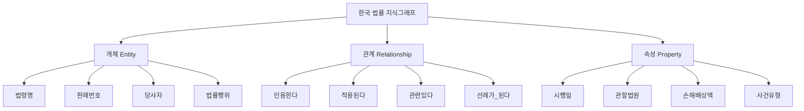
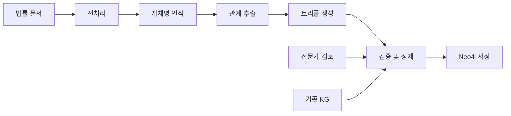
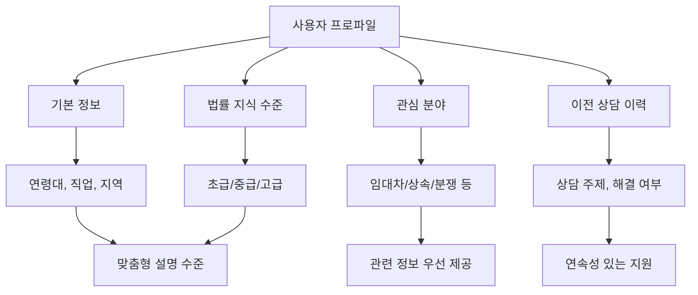
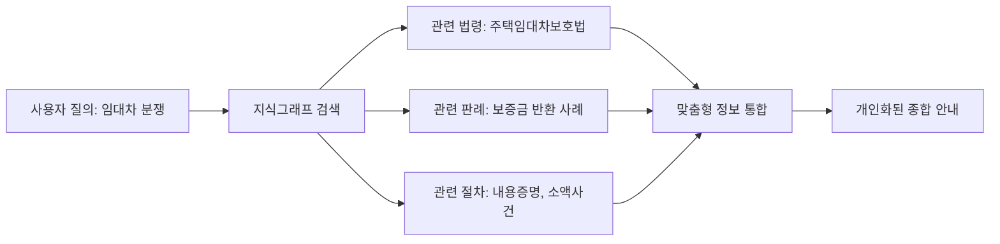

# 05. 개인 맞춤형 서비스 구현 🎯

## 📋 목차

- [한국 법률 지식그래프 구축](#한국-법률-지식그래프-구축)
- [고도화된 대화형 AI](#고도화된-대화형-ai)
- [개인화 알고리즘](#개인화-알고리즘)
- [맞춤형 정보 제공 시스템](#맞춤형-정보-제공-시스템)

---

## 🕸️ 한국 법률 지식그래프 구축

### 1. 지식그래프 필요성 및 가치

#### 개인 맞춤형 정보 제공의 핵심

포괄적인 한국 법률 지식그래프 구축은 개인 맞춤형 정보 검색 및 제공에 있어 매우 중요한 전략적 자산입니다. 지식그래프는 법령, 판례, 법률 용어, 사건 유형, 절차 등 다양한 법률 지식 요소들을 개체(entity)로 정의하고 이들 간의 관계(relationship)를 구조화하여 표현합니다.



### 2. 오픈소스 기반 구축 도구

#### 개체명 인식(NER) 및 관계 추출(RE)

```python
# 법률 지식그래프 구축 파이프라인
kg_construction_pipeline = {
    "데이터_소스": {
        "AI_Hub_데이터": "법률 지식기반 관계 데이터 (dataSetSn=71722)",
        "판결문": "법률/규정 텍스트 분석 데이터 (dataSetSn=580)",
        "법령": "법률 지식베이스 (dataSetSn=29)",
        "공단_데이터": "축적된 상담 사례 (익명화 처리)"
    },
    "추출_도구": {
        "NER_모델": "한국어 법률 개체명 인식 (미세조정)",
        "RE_모델": "관계 추출 모델",
        "KGGen": "LLM 기반 지식그래프 추출 도구"
    },
    "저장_시스템": {
        "그래프_DB": "Neo4j",
        "메타데이터": "DataHub 또는 Apache Atlas",
        "검색_엔진": "Elasticsearch"
    }
}
```

#### 지식그래프 구조 설계

```python
# 법률 지식그래프 스키마
legal_kg_schema = {
    "법령_개체": {
        "속성": ["법령명", "조항", "시행일", "개정이력"],
        "관계": ["포함한다", "개정한다", "폐지한다"]
    },
    "판례_개체": {
        "속성": ["사건번호", "법원", "판결일", "사건유형"],
        "관계": ["인용한다", "변경한다", "확인한다"]
    },
    "당사자_개체": {
        "속성": ["역할", "유형", "특성"],
        "관계": ["청구한다", "항변한다", "승소한다"]
    },
    "법률행위_개체": {
        "속성": ["행위유형", "요건", "효과"],
        "관계": ["성립한다", "무효이다", "취소된다"]
    }
}
```

### 3. AI Hub 데이터 활용 전략

#### 세법 분야 지식그래프 확장

- **기반 데이터**: AI Hub 법률 지식기반 관계 데이터 (3만 9,035건)
- **구조**: 트리플 라벨링 (주체-관계-객체) 형태
- **확장 방향**: 세법에서 전체 법률 도메인으로 점진적 확장

#### 자동화된 지식그래프 구축



---

## 🤖 고도화된 대화형 AI

### 1. 다회성 대화 관리

#### LangChain 메모리 시스템

```python
# 대화 메모리 관리 시스템
conversation_memory = {
    "Buffer_Memory": {
        "기능": "최근 대화 내용 저장",
        "용량": "토큰 제한 내 최대 보관",
        "활용": "단기 문맥 유지"
    },
    "Summary_Memory": {
        "기능": "대화 요약 저장",
        "압축": "긴 대화의 핵심 내용 요약",
        "활용": "장기 문맥 유지"
    },
    "Entity_Memory": {
        "기능": "중요 개체 정보 저장",
        "대상": "당사자, 사건, 날짜 등",
        "활용": "개인화된 정보 제공"
    },
    "Knowledge_Graph_Memory": {
        "기능": "지식그래프 연동 메모리",
        "특징": "구조화된 법률 지식 활용",
        "활용": "복잡한 법률 관계 추론"
    }
}
```

#### 문맥 이해 및 유지

- **세션 관리**: 사용자별 독립적인 대화 세션
- **상태 추적**: 문제 해결 진행 상황 모니터링
- **의도 파악**: 사용자의 숨겨진 의도 추론

### 2. 정교한 프롬프트 엔지니어링

#### 법률 분야 특화 프롬프트

```python
# 법률 AI 프롬프트 템플릿
legal_prompt_templates = {
    "역할_정의": """
    당신은 대한민국 법률구조공단의 법률 정보 안내 AI입니다.
    - 정확하고 중립적인 정보를 제공해야 합니다
    - 법률 조언이 아닌 정보 제공에 국한됩니다
    - 복잡한 사안은 전문가 상담을 권유해야 합니다
    """,

    "퓨샷_예시": """
    Q: 임대차 보증금을 돌려받지 못했어요.
    A: 임대차 보증금 반환 문제는 주택임대차보호법에 따라 처리됩니다.
    먼저 내용증명을 통해 반환을 요구하고, 이후 소액사건심판이나
    민사소송을 고려할 수 있습니다. 구체적인 상황에 따라 절차가
    달라질 수 있으므로 상담을 받아보시기 바랍니다.
    """,

    "연쇄적_사고": """
    단계별로 생각해보겠습니다:
    1. 먼저 법률 문제의 유형을 파악합니다
    2. 관련 법령과 판례를 검토합니다
    3. 가능한 해결 방안을 제시합니다
    4. 각 방안의 장단점을 설명합니다
    5. 다음 단계를 안내합니다
    """
}
```

### 3. 개인화된 대화 경험

#### 사용자 프로파일링



---

## 📊 개인화 알고리즘

### 1. 사용자 행동 분석

#### 상호작용 패턴 분석

```python
# 사용자 행동 분석 시스템
user_behavior_analysis = {
    "질의_패턴": {
        "빈도": "자주 묻는 질문 유형",
        "복잡도": "질문의 법적 복잡성 수준",
        "시간대": "주로 이용하는 시간대"
    },
    "만족도_지표": {
        "피드백": "긍정/부정 피드백 비율",
        "재질의": "같은 주제 반복 질문 여부",
        "완료율": "문제 해결 완료 비율"
    },
    "선호도_분석": {
        "정보_깊이": "간단한 설명 vs 상세한 설명",
        "제공_방식": "텍스트 vs 체크리스트 vs 도표",
        "상담_채널": "AI vs 인간 상담원 선호도"
    }
}
```

### 2. 추천 시스템

#### 콘텐츠 기반 필터링

- **법률 문서 추천**: 사용자 질의와 유사한 판례/법령
- **관련 서비스 추천**: 문제 유형에 맞는 공단 서비스
- **학습 자료 추천**: 사용자 수준에 맞는 법률 정보

#### 협업 필터링

- **유사 사용자**: 비슷한 법률 문제를 가진 사용자 그룹
- **성공 사례**: 유사한 문제를 해결한 사례 추천
- **전문가 매칭**: 해당 분야 전문 상담원 추천

---

## 🎯 맞춤형 정보 제공 시스템

### 1. 동적 정보 생성

#### 상황별 맞춤 정보

```python
# 맞춤형 정보 생성 엔진
personalized_info_engine = {
    "입력_분석": {
        "사용자_상황": "구체적인 법률 문제 상황",
        "개인_정보": "연령, 직업, 소득 수준 등",
        "선호도": "정보 제공 방식 선호도"
    },
    "정보_선별": {
        "관련성_점수": "사용자 상황과의 관련도",
        "중요도_점수": "해당 정보의 중요성",
        "이해도_점수": "사용자 수준에 맞는 난이도"
    },
    "출력_생성": {
        "핵심_정보": "가장 중요한 정보 우선 제시",
        "단계별_안내": "순차적 행동 지침",
        "주의사항": "놓치기 쉬운 중요 포인트"
    }
}
```

### 2. 지식그래프 기반 추론

#### 복합적 정보 연결



#### 추론 기반 정보 제공

- **법적 연관성**: 하나의 문제와 관련된 모든 법적 측면
- **절차적 연결**: 단계별 절차의 논리적 연결
- **예외 상황**: 일반적이지 않은 특수 상황 고려

### 3. 실시간 개인화

#### 대화 중 적응

```python
# 실시간 개인화 시스템
realtime_personalization = {
    "대화_분석": {
        "이해도_측정": "사용자의 법률 지식 수준 실시간 파악",
        "관심도_측정": "특정 정보에 대한 관심도",
        "만족도_측정": "제공된 정보에 대한 만족도"
    },
    "적응_전략": {
        "설명_수준_조정": "더 쉽게 또는 더 자세히",
        "정보_범위_조정": "핵심만 또는 포괄적으로",
        "제공_방식_변경": "텍스트, 도표, 체크리스트 등"
    },
    "학습_반영": {
        "사용자_프로필_업데이트": "새로운 선호도 반영",
        "추천_알고리즘_개선": "개인화 정확도 향상",
        "콘텐츠_우선순위_조정": "관심 분야 우선 제공"
    }
}
```

---

## 📈 개인화 성과 측정

### 핵심 지표

| 지표              | 측정 방법               | 목표     |
| ----------------- | ----------------------- | -------- |
| **개인화 정확도** | 추천 정보 클릭률        | 70% 이상 |
| **사용자 만족도** | 개인화 관련 피드백      | 4.5/5.0  |
| **문제 해결률**   | 맞춤 정보로 해결된 비율 | 80% 이상 |
| **재방문율**      | 동일 사용자 재이용률    | 60% 이상 |

### 지속적 개선

#### A/B 테스트

- **개인화 vs 일반화**: 개인화된 정보 제공의 효과 측정
- **추천 알고리즘**: 다양한 추천 방식의 성능 비교
- **UI/UX**: 개인화 정보 표시 방식 최적화

#### 피드백 루프

```mermaid
cycle
    사용자_상호작용 --> 데이터_수집
    데이터_수집 --> 패턴_분석
    패턴_분석 --> 알고리즘_개선
    알고리즘_개선 --> 개인화_향상
    개인화_향상 --> 사용자_상호작용
```

---

## 🔗 관련 문서

- [← 04. 사용자 중심 문제 해결 전략](./04_user_centric_solutions.md)
- [→ 06. 전략적 제언 및 로드맵](./06_strategic_recommendations.md)
- [📚 메인 인덱스로 돌아가기](./README.md)

---

_"개인 맞춤형 서비스는 AI가 단순한 정보 제공자에서 지능적인 법률 파트너로 진화하는 핵심 요소입니다."_

**작성일**: 2024년 12월 19일
**다음 섹션**: [전략적 제언 및 로드맵](./06_strategic_recommendations.md)
