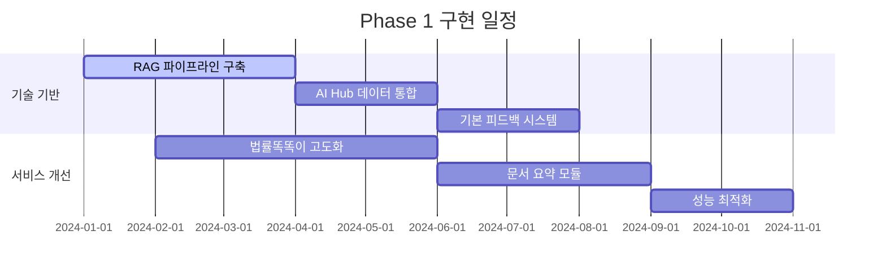
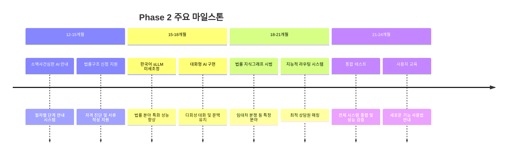
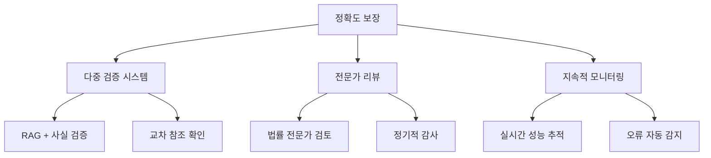

# 06. 전략적 제언 및 로드맵 📈

## 📋 목차

- [단계별 구현 로드맵](#단계별-구현-로드맵)
- [핵심 성공 요인](#핵심-성공-요인)
- [위험 관리 전략](#위험-관리-전략)
- [투자 및 자원 계획](#투자-및-자원-계획)

---

## 🗓️ 단계별 구현 로드맵

### Phase 1: 기반 강화 (6-12개월)

#### 🎯 목표

기존 AI 서비스의 성능을 대폭 향상시키고 향후 고도화를 위한 기술적 기반을 구축합니다.



#### 📋 주요 과제

**1. 기존 챗봇 고도화**

```python
# Phase 1 기술 스택
phase1_implementation = {
    "RAG_시스템": {
        "임베딩_모델": "KoSimCSE-roberta-base",
        "생성_모델": "Polyglot-Ko-1.3B (미세조정)",
        "벡터_DB": "ChromaDB",
        "프레임워크": "LangChain"
    },
    "데이터_통합": {
        "AI_Hub": "법률 지식베이스 (27만 건)",
        "기존_데이터": "공단 상담 사례 (익명화)",
        "전처리": "데이터 정제 및 구조화"
    },
    "성능_목표": {
        "Q&A_정확도": "85% 이상",
        "응답_시간": "3초 이내",
        "동시_사용자": "100명 지원"
    }
}
```

**2. 법률 문서 요약 모듈**

- AI Hub 요약 데이터셋 (3만 건) 활용
- Polyglot-Ko 또는 SOLAR mini 미세조정
- 판결문, 법령, 상담 사례 요약 기능

**3. 기본 피드백 시스템**

- Langfuse 또는 Chatwoot 기반 구축
- 사용자 만족도 실시간 수집
- 답변 품질 모니터링 체계

#### 📊 예상 성과

| 지표          | 현재    | Phase 1 목표 |
| ------------- | ------- | ------------ |
| Q&A 정확도    | 70%     | 85%          |
| 사용자 만족도 | 3.2/5.0 | 4.0/5.0      |
| 응답 시간     | 5-10초  | 3초 이내     |

### Phase 2: 사용자 중심 확장 (12-24개월)

#### 🎯 목표

사용자 중심의 문제 해결 기능을 구현하고 개인화 서비스의 기초를 마련합니다.



#### 📋 주요 과제

**1. 소액사건심판 AI 안내**

```python
# 소액사건심판 안내 시스템
small_claims_guide = {
    "자격_확인": {
        "청구금액": "3,000만원 이하 확인",
        "관할": "피고 주소지 또는 의무이행지",
        "시효": "채권별 소멸시효 확인"
    },
    "서류_준비": {
        "소장": "자동 양식 생성 지원",
        "증거": "필요 증거 체크리스트",
        "비용": "인지대 및 송달료 계산"
    },
    "절차_안내": {
        "단계별": "접수→이행권고→이의신청→집행",
        "기간": "각 단계별 소요 기간 안내",
        "주의사항": "놓치기 쉬운 중요 포인트"
    }
}
```

**2. 법률구조 신청 지원**

- 신청 자격 사전 진단 시스템
- 필요 서류 자동 체크리스트 생성
- 신청서 작성 단계별 가이드

**3. 한국어 sLLM 미세조정**

- 공단 내부 데이터 활용 (익명화 처리)
- 법률 분야 특화 성능 향상
- 대화형 AI 기능 구현

#### 📊 예상 성과

| 지표         | Phase 1 | Phase 2 목표 |
| ------------ | ------- | ------------ |
| 자가 해결률  | 40%     | 65%          |
| 개인화 수준  | 기본    | 중급         |
| 지원 절차 수 | 2개     | 5개          |

### Phase 3: 고급 서비스 (24개월+)

#### 🎯 목표

완전한 개인 맞춤형 법률 AI 서비스를 구현하고 지속적 개선 체계를 확립합니다.

#### 📋 주요 과제

**1. 법률 지식그래프 확장**

```python
# 확장된 지식그래프 시스템
expanded_kg_system = {
    "도메인_확장": {
        "민사": "계약, 불법행위, 물권 등",
        "형사": "범죄 유형별 절차",
        "행정": "행정처분, 이의신청 등",
        "가사": "이혼, 상속, 후견 등"
    },
    "고급_기능": {
        "추론_엔진": "복잡한 법률 관계 추론",
        "예측_모델": "사건 결과 예측",
        "유사_사례": "과거 사례 기반 추천"
    },
    "실시간_업데이트": {
        "법령_개정": "자동 반영 시스템",
        "판례_추가": "새로운 판례 즉시 통합",
        "피드백_반영": "사용자 피드백 기반 개선"
    }
}
```

**2. 고급 대화형 에이전트**

- 복잡한 다회성 대화 처리
- 지능적 라우팅 및 전문가 연결
- 예측적 법률 지원 기능

**3. 지속적 개선 루프**

- 자동화된 성능 평가 시스템
- 사용자 피드백 기반 모델 업데이트
- A/B 테스트를 통한 최적화

---

## 🎯 핵심 성공 요인

### 1. 기술적 우수성

#### 정확도 우선 원칙



#### 한국어 최적화

- 법률 용어 및 문맥 이해 능력 강화
- 한국 법체계 특성 반영
- 지속적인 언어 모델 개선

#### 확장성 확보

- 대용량 데이터 처리 능력
- 동시 사용자 지원 확장
- 새로운 기능 추가 용이성

### 2. 윤리적 원칙 준수

#### 명확한 경계 설정

```python
# 윤리적 가이드라인
ethical_guidelines = {
    "정보_vs_조언": {
        "제공_가능": "일반적인 법률 정보",
        "제공_불가": "구체적인 법률 조언",
        "경계_표시": "모든 응답에 면책 조항 포함"
    },
    "투명성": {
        "AI_표시": "AI와 상호작용 중임을 명확히 표시",
        "한계_공개": "AI의 능력과 한계 솔직한 공개",
        "출처_인용": "모든 정보의 출처 명시"
    },
    "개인정보보호": {
        "데이터_최소화": "필요 최소한의 정보만 수집",
        "익명화": "개인식별정보 철저한 보호",
        "보안": "강력한 데이터 보안 체계"
    }
}
```

### 3. 사용자 중심 설계

#### 직관적 인터페이스

- 법률 전문가가 아닌 일반인도 쉽게 사용
- 단계별 안내를 통한 복잡성 해소
- 다양한 접근 방식 지원

#### 신뢰성 구축

- 결과에 대한 근거와 출처 명시
- 일관된 품질의 정보 제공
- 투명한 의사결정 과정

---

## ⚠️ 위험 관리 전략

### 주요 위험 요소 및 대응 방안

| 위험 요소            | 영향도  | 발생 확률 | 대응 전략                   |
| -------------------- | ------- | --------- | --------------------------- |
| **AI 환각 현상**     | 🔴 높음 | 🟡 중간   | RAG + 사실 검증 + 출처 인용 |
| **법률 용어 오해석** | 🔴 높음 | 🟢 낮음   | 전문가 검증 + 용어 사전     |
| **개인정보 유출**    | 🔴 높음 | 🟢 낮음   | 강화된 보안 + 익명화        |
| **시스템 성능 저하** | 🟡 중간 | 🟡 중간   | 모니터링 + 자동 확장        |
| **사용자 저항**      | 🟡 중간 | 🟡 중간   | 교육 + 점진적 도입          |

### 위험 완화 전략

#### 기술적 대응

```python
# 위험 완화 시스템
risk_mitigation_system = {
    "환각_방지": {
        "RAG_시스템": "신뢰할 수 있는 소스 기반 답변",
        "신뢰도_점수": "답변의 신뢰도 수치화",
        "출처_인용": "모든 정보의 출처 명시"
    },
    "성능_보장": {
        "로드_밸런싱": "트래픽 분산 처리",
        "캐싱": "자주 사용되는 정보 캐싱",
        "모니터링": "실시간 성능 추적"
    },
    "보안_강화": {
        "암호화": "데이터 전송 및 저장 암호화",
        "접근_제어": "역할 기반 접근 권한",
        "감사_로그": "모든 활동 기록 및 추적"
    }
}
```

---

## 💰 투자 및 자원 계획

### 단계별 투자 계획

#### Phase 1 (6-12개월)

```python
# Phase 1 투자 계획
phase1_investment = {
    "인력": {
        "AI_엔지니어": "3명 (LLM, RAG 전문)",
        "데이터_사이언티스트": "2명",
        "법률_전문가": "2명 (자문)",
        "프로젝트_매니저": "1명"
    },
    "인프라": {
        "GPU_서버": "A100 4대 (모델 학습용)",
        "추론_서버": "T4 8대 (서비스용)",
        "스토리지": "100TB (데이터 저장)",
        "네트워크": "고속 인터넷 및 CDN"
    },
    "소프트웨어": {
        "오픈소스": "무료 (LangChain, ChromaDB 등)",
        "상용_도구": "모니터링, 보안 솔루션",
        "클라우드": "AWS/Azure 크레딧"
    },
    "예상_비용": "15억원 (인력 10억 + 인프라 5억)"
}
```

#### Phase 2 (12-24개월)

- **인력 확장**: AI 엔지니어 2명, UX 디자이너 1명 추가
- **인프라 확장**: 서비스 사용자 증가에 따른 서버 증설
- **예상 비용**: 20억원

#### Phase 3 (24개월+)

- **연구개발**: 고급 AI 기능 연구
- **글로벌 확장**: 다국어 지원 및 해외 진출
- **예상 비용**: 연간 25억원

### ROI 분석

#### 비용 절감 효과

```python
# ROI 계산
roi_analysis = {
    "비용_절감": {
        "상담원_업무_효율": "50% 향상 → 연간 10억원 절감",
        "반복_문의_자동화": "70% 자동 처리 → 연간 5억원 절감",
        "문서_처리_자동화": "80% 효율 향상 → 연간 3억원 절감"
    },
    "서비스_향상": {
        "사용자_만족도": "40% 향상",
        "문제_해결_시간": "60% 단축",
        "서비스_접근성": "24/7 지원"
    },
    "총_효과": {
        "연간_절감": "18억원",
        "투자_회수": "3년 이내",
        "순현재가치": "긍정적"
    }
}
```

---

## 📊 성과 측정 및 평가

### KPI 체계

#### 기술적 성과

| 지표          | 현재   | Phase 1 | Phase 2 | Phase 3 |
| ------------- | ------ | ------- | ------- | ------- |
| Q&A 정확도    | 70%    | 85%     | 92%     | 95%     |
| 응답 시간     | 5-10초 | 3초     | 2초     | 1초     |
| 시스템 가용성 | 95%    | 99%     | 99.5%   | 99.9%   |

#### 사용자 성과

| 지표          | 현재    | Phase 1 | Phase 2 | Phase 3 |
| ------------- | ------- | ------- | ------- | ------- |
| 사용자 만족도 | 3.2/5.0 | 4.0/5.0 | 4.3/5.0 | 4.5/5.0 |
| 자가 해결률   | 30%     | 50%     | 70%     | 80%     |
| 재방문율      | 40%     | 55%     | 65%     | 70%     |

### 지속적 개선 체계

#### 정기 평가

- **월간**: 기술적 성능 지표 검토
- **분기**: 사용자 만족도 조사
- **반기**: 전체 시스템 감사
- **연간**: 전략적 방향 재검토

---

## 🔗 관련 문서

- [← 05. 개인 맞춤형 서비스 구현](./05_personalized_services.md)
- [→ 07. 데이터 거버넌스 및 윤리](./07_governance_ethics.md)
- [📚 메인 인덱스로 돌아가기](./README.md)

---

_"체계적인 로드맵과 명확한 성공 요인을 바탕으로 공단의 AI 서비스 혁신을 단계적으로 실현해 나갈 수 있습니다."_

**작성일**: 2024년 12월 19일
**다음 섹션**: [데이터 거버넌스 및 윤리](./07_governance_ethics.md)
