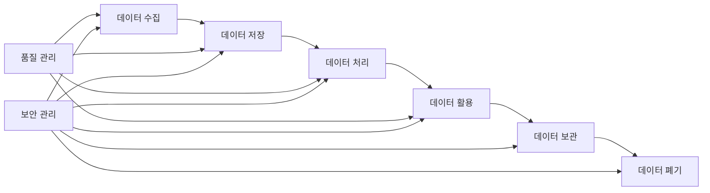
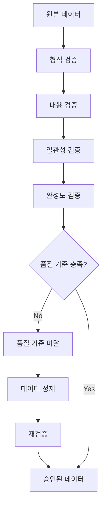
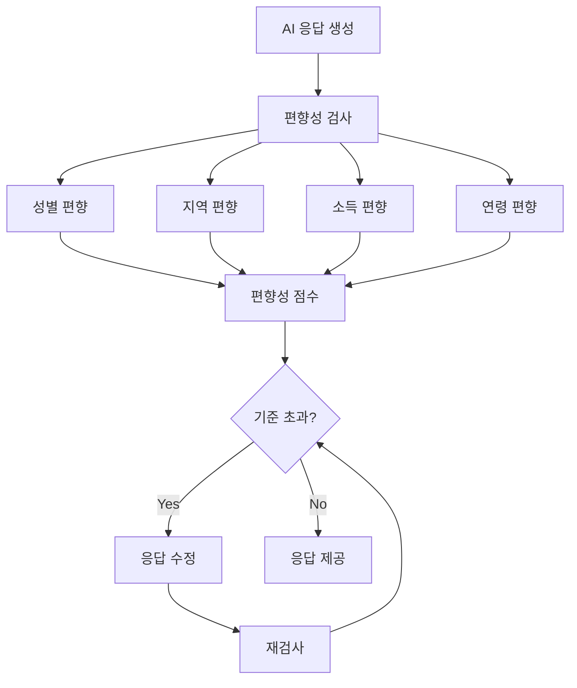
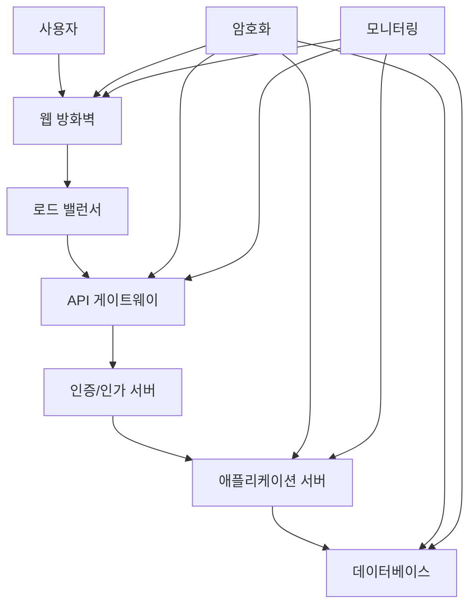

# 07. 데이터 거버넌스 및 윤리 🛡️

## 📋 목차
- [데이터 거버넌스 체계](#데이터-거버넌스-체계)
- [윤리적 AI 사용 원칙](#윤리적-ai-사용-원칙)
- [개인정보보호 및 보안](#개인정보보호-및-보안)
- [법적 준수 사항](#법적-준수-사항)

---

## 🏛️ 데이터 거버넌스 체계

### 1. 데이터 관리 프레임워크

#### 데이터 생명주기 관리


#### 데이터 분류 체계
```python
# 데이터 분류 및 관리 정책
data_classification = {
    "공개_데이터": {
        "예시": "AI Hub 공개 데이터셋, 법령 텍스트",
        "보안_수준": "낮음",
        "접근_권한": "전체 개발팀",
        "보관_기간": "영구"
    },
    "내부_데이터": {
        "예시": "공단 내부 상담 사례 (익명화)",
        "보안_수준": "중간",
        "접근_권한": "승인된 개발자",
        "보관_기간": "5년"
    },
    "민감_데이터": {
        "예시": "개인식별정보, 상담 기록",
        "보안_수준": "높음",
        "접근_권한": "최소 필요 인원",
        "보관_기간": "법정 기간"
    },
    "기밀_데이터": {
        "예시": "AI 모델 가중치, 알고리즘",
        "보안_수준": "최고",
        "접근_권한": "핵심 개발자",
        "보관_기간": "사업 필요 기간"
    }
}
```

### 2. 메타데이터 관리

#### DataHub 기반 메타데이터 시스템
```python
# 법률 데이터 메타데이터 스키마
legal_metadata_schema = {
    "법령_데이터": {
        "필수_속성": [
            "법령명", "조항번호", "시행일",
            "개정이력", "관련_키워드"
        ],
        "선택_속성": [
            "관할기관", "적용대상", "벌칙조항"
        ],
        "데이터_계보": "원본 → 전처리 → 임베딩 → 검색"
    },
    "판례_데이터": {
        "필수_속성": [
            "사건번호", "법원", "판결일",
            "사건유형", "핵심_쟁점"
        ],
        "선택_속성": [
            "당사자", "변호사", "손해액"
        ],
        "품질_지표": "완성도, 정확도, 최신성"
    }
}
```

### 3. 데이터 품질 관리

#### 자동화된 품질 검증


#### 품질 지표 및 기준
| 품질 차원 | 측정 지표 | 기준 | 개선 방안 |
|-----------|-----------|------|-----------|
| **완성도** | 필수 필드 채움률 | 95% 이상 | 자동 보완 로직 |
| **정확도** | 전문가 검증 통과율 | 98% 이상 | 교차 검증 |
| **일관성** | 형식 표준 준수율 | 99% 이상 | 자동 정규화 |
| **최신성** | 업데이트 주기 준수 | 월 1회 | 자동 모니터링 |

---

## ⚖️ 윤리적 AI 사용 원칙

### 1. 법률 정보 vs 법률 조언 구분

#### 명확한 경계 설정
```python
# AI 응답 분류 시스템
ai_response_classification = {
    "정보_제공_가능": {
        "일반적_법률_정보": "법령 조문, 절차 안내",
        "참고_사례": "유사 판례, 상담 사례",
        "절차_안내": "신청 방법, 필요 서류",
        "기관_정보": "관련 기관 연락처"
    },
    "제공_금지": {
        "구체적_법률_조언": "개별 사안 판단",
        "소송_전략": "구체적 대응 방안",
        "법적_결과_예측": "승소 가능성 등",
        "의사결정_대행": "법적 선택 결정"
    },
    "경계_표시": {
        "면책_조항": "모든 응답에 포함",
        "전문가_상담_권유": "복잡한 사안 시",
        "AI_한계_명시": "능력 범위 명확화"
    }
}
```

#### 자동 면책 조항 시스템
```markdown
## 표준 면책 조항 템플릿

⚠️ **중요 안내**
- 본 정보는 일반적인 법률 정보 제공을 목적으로 합니다
- 개별 사안에 대한 법률 조언이 아닙니다
- 구체적인 법적 문제는 반드시 전문가와 상담하시기 바랍니다
- 본 정보를 근거로 한 법적 행위의 결과에 대해 책임지지 않습니다

📞 **전문가 상담**: 공단 상담 예약 (☎ 132)
```

### 2. AI 투명성 및 설명가능성

#### 설명가능한 AI (XAI) 구현
```python
# XAI 구현 전략
explainable_ai_strategy = {
    "답변_근거_제시": {
        "출처_인용": "참조한 법령, 판례 명시",
        "신뢰도_점수": "답변의 확실성 수치화",
        "대안_정보": "다른 관점의 정보 제공"
    },
    "의사결정_과정": {
        "검색_과정": "어떤 정보를 찾았는지",
        "추론_과정": "어떻게 결론에 도달했는지",
        "제한사항": "고려하지 못한 요소들"
    },
    "사용자_이해": {
        "쉬운_설명": "일반인이 이해할 수 있는 언어",
        "시각화": "복잡한 관계의 도식화",
        "단계별_안내": "논리적 흐름 제시"
    }
}
```

### 3. 편향성 완화 및 공정성

#### 편향성 모니터링 시스템


#### 공정성 보장 방안
- **다양한 관점 반영**: 여러 법적 해석 제시
- **균형잡힌 정보**: 찬반 양론 모두 제공
- **차별 방지**: 성별, 연령, 지역 등에 따른 차별적 정보 제공 금지
- **접근성 보장**: 장애인, 고령자 등을 위한 접근성 고려

---

## 🔒 개인정보보호 및 보안

### 1. 개인정보보호법(PIPA) 준수

#### 개인정보 처리 원칙
```python
# 개인정보 처리 정책
privacy_policy = {
    "수집_최소화": {
        "원칙": "서비스 제공에 필요한 최소한의 정보만 수집",
        "예시": "법률 상담을 위한 기본 정보",
        "금지": "불필요한 민감정보 수집"
    },
    "목적_제한": {
        "원칙": "수집 목적 범위 내에서만 사용",
        "명시": "수집 시 목적 명확히 고지",
        "변경": "목적 변경 시 재동의 획득"
    },
    "보관_기간": {
        "원칙": "목적 달성 후 즉시 파기",
        "예외": "법령에 의한 보관 의무",
        "자동_삭제": "보관 기간 만료 시 자동 삭제"
    }
}
```

#### 익명화 처리 기술
```python
# 데이터 익명화 기법
anonymization_techniques = {
    "식별자_제거": {
        "직접_식별자": "이름, 주민번호, 전화번호 삭제",
        "간접_식별자": "주소, 직업 등 일반화",
        "준식별자": "연령대, 지역 등으로 범주화"
    },
    "데이터_마스킹": {
        "부분_마스킹": "이름의 일부만 표시 (김○○)",
        "해시화": "원본 복구 불가능한 변환",
        "토큰화": "임의 값으로 대체"
    },
    "차분_프라이버시": {
        "노이즈_추가": "통계적 노이즈 삽입",
        "k_익명성": "동일한 속성 조합 k개 이상",
        "l_다양성": "민감 속성의 다양성 보장"
    }
}
```

### 2. 데이터 보안 체계

#### 다층 보안 아키텍처


#### 보안 통제 방안
| 보안 영역 | 통제 방안 | 구현 기술 |
|-----------|-----------|-----------|
| **네트워크** | 방화벽, VPN, SSL/TLS | AWS WAF, CloudFlare |
| **접근 제어** | 역할 기반 권한, MFA | OAuth 2.0, SAML |
| **데이터 암호화** | 전송/저장 암호화 | AES-256, RSA |
| **모니터링** | 실시간 로그 분석 | ELK Stack, SIEM |

---

## 📜 법적 준수 사항

### 1. AI 기본법 준수

#### AI 시스템 신뢰성 확보
```python
# AI 기본법 준수 체크리스트
ai_act_compliance = {
    "투명성": {
        "AI_사용_고지": "사용자에게 AI 사용 명시",
        "알고리즘_설명": "의사결정 과정 설명",
        "한계_공개": "AI의 능력과 한계 명시"
    },
    "공정성": {
        "차별_금지": "성별, 연령, 지역 등 차별 방지",
        "편향_완화": "알고리즘 편향성 지속 모니터링",
        "다양성_보장": "다양한 관점 반영"
    },
    "책임성": {
        "인간_감독": "중요 결정에 인간 개입",
        "오류_대응": "AI 오류 시 신속한 수정",
        "피해_구제": "AI로 인한 피해 구제 방안"
    }
}
```

### 2. 변호사법 및 법무사법 준수

#### 법률 서비스 제공 한계
- **법률 조언 금지**: 구체적인 법적 판단이나 조언 제공 금지
- **소송 대리 금지**: 법정 대리나 소송 수행 금지
- **수임 관계 부인**: 변호사-의뢰인 관계 성립 부인
- **전문가 연계**: 법률 조언 필요 시 전문가 연결

### 3. 정보통신망법 준수

#### 온라인 서비스 운영 기준
```python
# 정보통신망법 준수 사항
telecom_law_compliance = {
    "개인정보_보호": {
        "동의_획득": "개인정보 수집 시 명시적 동의",
        "처리_방침": "개인정보 처리방침 공개",
        "권리_보장": "열람, 정정, 삭제 권리 보장"
    },
    "서비스_안정성": {
        "가용성": "99% 이상 서비스 가용성",
        "백업": "정기적 데이터 백업",
        "복구": "장애 시 신속한 복구"
    },
    "이용자_보호": {
        "약관_명시": "이용약관 명확히 제시",
        "분쟁_해결": "이용자 분쟁 해결 절차",
        "손해_배상": "서비스 장애 시 배상 기준"
    }
}
```

---

## 🔄 지속적 모니터링 및 개선

### 윤리 위원회 운영

#### 구성 및 역할
- **구성**: 법률 전문가, AI 전문가, 시민사회 대표
- **역할**: 윤리 기준 수립, 정기 감사, 개선 권고
- **주기**: 분기별 정기 회의, 필요시 임시 회의

### 정기 감사 체계

#### 감사 영역 및 주기
| 감사 영역 | 주기 | 담당 | 결과 조치 |
|-----------|------|------|-----------|
| **AI 윤리 준수** | 분기 | 윤리위원회 | 개선 권고 |
| **개인정보보호** | 월간 | 보안팀 | 즉시 조치 |
| **법적 준수** | 반기 | 법무팀 | 정책 수정 |
| **기술적 보안** | 주간 | 개발팀 | 시스템 패치 |

---

## 🔗 관련 문서
- [← 06. 전략적 제언 및 로드맵](./06_strategic_recommendations.md)
- [→ 08. 지속적 개선 체계](./08_continuous_improvement.md)
- [📚 메인 인덱스로 돌아가기](./README.md)

---

*"강력한 데이터 거버넌스와 윤리적 AI 사용 원칙은 신뢰할 수 있는 법률 AI 서비스의 필수 기반입니다."*

**작성일**: 2024년 12월 19일
**다음 섹션**: [지속적 개선 체계](./08_continuous_improvement.md)
