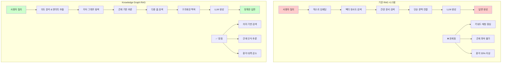
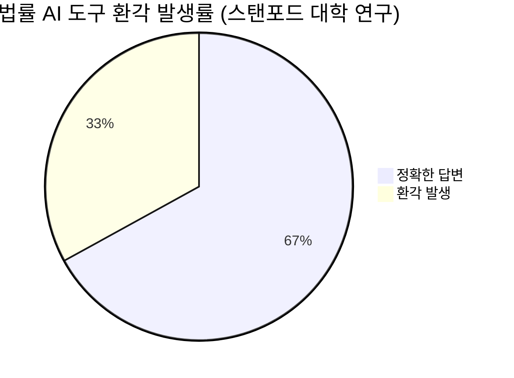
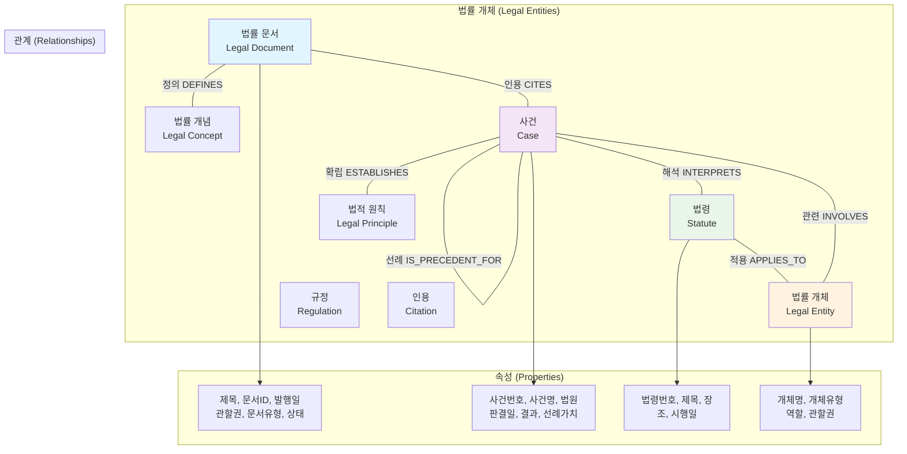
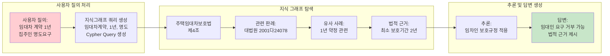
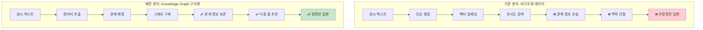
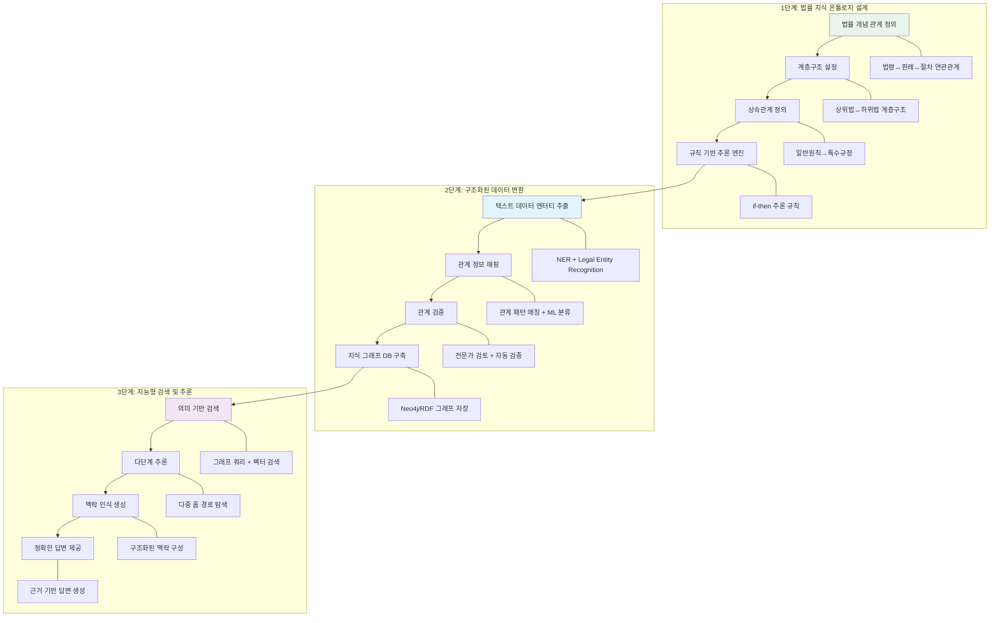
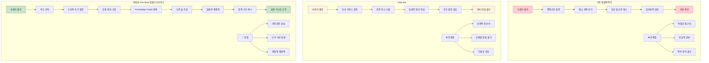
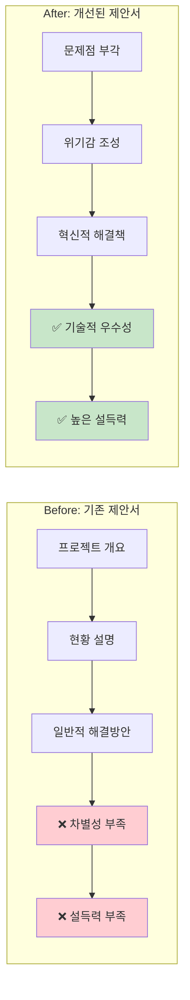
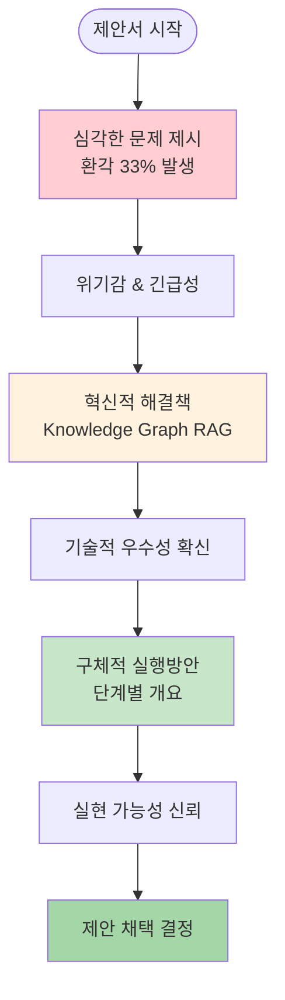

# 법률구조서비스 플랫폼 웹사이트 수정 계획서

## 📋 수정 개요

기존 제안서 웹사이트를 문제점 중심의 구조로 재편하여 제안 시 강조점을 명확히 하고, RAG 시스템 한계와 Knowledge Graph 기반 해결방안을 부각시키는 방향으로 수정

---

## 🔍 1. 제목 및 브랜딩 변경

### 1.1 주요 제목 변경사항

- **Hero Section 메인 제목**: "법률구조서비스 플랫폼 One-Stop 법률똑똑이 개선 제안서" → "법률구조서비스 플랫폼 개선 제안서"
- **Navigation 로고**: "법률똑똑이 개선 제안" → "법률구조서비스 플랫폼 개선 제안"
- **페이지 타이틀**: HTML head의 title 태그도 동일하게 변경
- **전체 문서 내 "법률똑똑이" 용어**: 모두 "법률구조서비스 플랫폼"으로 일관성 있게 변경

### 1.2 서브 제목 수정

- Hero section의 부제: "One-Stop 맞춤형 법률구조 서비스 구현을 위한 AI 고도화 전략"은 유지
- 정책 배지의 내용은 그대로 유지 (국정과제 64-5 관련)

---

## 🔄 2. 섹션 순서 재배치

### 2.1 기존 순서

1. 프로젝트 개요 (#overview)
2. 현재 서비스의 한계 (#current)
3. 해결방안 (#solution)
4. 기존 vs 개선된 AI 대화 방식 비교 (#example)
5. AI 서비스 구조 (#architecture)
6. 데이터 수집 및 관리 방안 (#data)
7. 단계별 구현 일정 (#timeline)
8. 기대 효과 (#benefits)
9. 프로젝트 문의 (#contact)

### 2.2 변경된 순서

1. **현재 서비스의 한계** (#current) - 문제점 우선 부각
2. **해결방안** (#solution) - 즉시 해결책 제시
3. **프로젝트 개요** (#overview) - 전체적인 방향성 설명
4. 기존 vs 개선된 AI 대화 방식 비교 (#example)
5. AI 서비스 구조 (#architecture)
6. 데이터 수집 및 관리 방안 (#data)
7. 단계별 구현 일정 (#timeline)
8. 기대 효과 (#benefits)
9. 프로젝트 문의 (#contact)

### 2.3 Navigation 메뉴 순서 변경

- 상단 네비게이션과 모바일 네비게이션의 링크 순서도 동일하게 조정
- "현황" → "솔루션" → "개요" 순서로 배치

---

## 📊 3. 현재 서비스의 한계 섹션 대폭 수정

### 3.1 섹션 제목 변경

- "현재 서비스의 한계" → "기존 RAG 시스템의 근본적 한계"

### 3.2 기존 내용 문제점

### 3.2.1 문제점 1: 정보 통합 및 추론 능력의 한계

**현황**
- 현행 시스템은 질문과 문서 간 텍스트 유사도 기반 매칭을 통해 답변을 생성함
- 단일 문서 또는 유사한 문서 클러스터 내에서의 정보 검색에 최적화되어 있음

**문제점**
- 법률 상담의 특성상 여러 법조문, 판례, 행정해석을 종합적으로 고려해야 하는 복합적 질의에 대한 답변 품질이 저하됨
- 개별 문서 간 관계성 및 맥락적 연관성을 파악하지 못하여 단편적 정보만 제공하는 한계 존재
- 법률 적용 시 필요한 다층적 추론 과정(사실관계 → 쟁점 도출 → 관련 법령 검토 → 적용 결과)을 수행하지 못함

**개선 방향**
- Graph RAG 구조 도입을 통한 문서 간 관계성 모델링 및 다차원적 정보 통합 시스템 구축 필요

### 3.2.2 문제점 2: 대화 연속성 및 심화 상담 기능의 부재

**현황**
- 현행 시스템은 일회성 질의응답 방식으로 운영되어 단발성 답변 제공에 그침
- 대화 세션 간 맥락 유지 및 이전 상담 내용 연계 기능 미비

**문제점**
- 법률 상담의 특성상 초기 질문에서 파생되는 후속 질문이나 세부 사항에 대한 지속적 상담이 불가능함
- 상담자의 구체적 상황에 따른 맞춤형 추가 정보 제공 및 단계적 문제 해결 지원 한계
- 법률 문제의 복잡성으로 인해 필요한 다회차 상담 및 심화 논의를 지원하지 못함

**개선 방향**
- 대화 히스토리 관리 및 맥락 유지 기능 강화를 통한 연속적 상담 환경 구축
- 질문자의 상황별 맞춤형 후속 질문 제안 및 관련 정보 능동적 제공 시스템 도입 필요

### 3.3 기존 데이터 구조화의 전략적 중요성과 Graph RAG 도입 필요성

#### 3.3.1 현행 시스템의 핵심 문제점

현재 RAG 시스템은 텍스트 유사도 기반 검색으로 **"많은 데이터 중에서 가장 비슷한 것"**을 찾는 방식입니다. 그러나 법률 분야에서는 **"정확히 연관된 모든 정보"**를 체계적으로 제공해야 합니다.

예를 들어 "임대차 보증금 반환" 질의 시, 현행 시스템은 가장 유사한 몇 개 문서만 반환하지만, 실제로는 임대차보호법, 민법, 관련 판례, 행정해석이 상호 연결된 하나의 체계로 검토되어야 합니다. 단순히 더 많은 데이터를 추가해도 이러한 관계성 부재 문제는 해결되지 않습니다.

#### 3.3.2 기존 데이터 구조화의 전략적 가치

**구조화를 통한 데이터 품질의 기하급수적 향상**

현재 보유한 법령, 판례, 해석례 데이터를 Graph RAG로 구조화하면 1+1=10의 효과가 발생합니다. 동일한 데이터량이지만 조문 간 참조관계, 판례-법령 연결관계, 개념 위계구조를 명시적으로 표현함으로써 데이터의 활용 가치가 exponential하게 증가합니다.

**정확성과 완전성의 동시 확보**

단순 데이터 추가는 양적 확장이지만, 구조화는 질적 혁신. 예를 들어:

- **기존 방식**: "계약해제" 검색 → 유사 문서 10개 반환 → 상담사가 직접 관련성 판단
- **구조화 방식**: "계약해제" 검색 → 민법 제544조 + 관련 특별법 + 연관 판례 + 예외규정을 관계망으로 연결하여 체계적 제공


#### 3.3.3 단계적 확장을 통한 시너지 극대화

**1단계: 기존 데이터 구조화**

- 현재 보유 중인 법령, 판례, 해석례를 Graph 구조로 재구성
- 법률 도메인 특화 온톨로지 구축 및 관계 정의
- 구조화 패턴과 자동화 파이프라인 확립

**2단계: 신규 데이터의 구조화 통합**

- 1단계에서 구축된 구조화 패턴을 기반으로 신규 데이터 자동 통합
- 기존 구조와의 연결점 자동 탐지 및 관계망 확장
- 기존 구조 + 신규 데이터 = 기하급수적 가치 증대

핵심은 순서입니다. 구조화 없이 데이터만 추가하면 선형적 개선에 그치지만, 먼저 구조화 기반을 다진 후 데이터를 확장하면 네트워크 효과가 발생하여 전체 시스템의 가치가 급격히 증가합니다.

**결론적으로**, Graph RAG 기반 데이터 구조화는 단순한 기술적 개선이 아닌 법률 서비스 패러다임의 전환입니다. 기존 데이터의 잠재 가치를 최대한 활용한 후, 이를 토대로 신규 데이터를 체계적으로 통합하는 것이 가장 효율적이고 지속가능한 발전 전략입니다.

### 3.4 새로운 구성 내용

#### 3.4.1 섹션 헤더 수정

- 메인 제목: "기존 RAG 시스템의 근본적 한계"
- 부제: "단순 텍스트 유사도 기반 검색으로는 법률 분야의 복잡한 추론과 정확한 정보 제공이 한계에 도달"

#### 3.4.2 핵심 문제점 3가지로 집약

**문제점 1: 의미적 연관성 부족**

- 현상: 키워드 매칭 중심의 단순 검색
- 한계: 법령-판례-절차 간의 논리적 연관관계 파악 불가
- 결과: 관련 없는 정보 제공, 맥락 무시

**문제점 2: 구조화되지 않은 정보 처리**

- 현상: 비정형 텍스트 덩어리로만 학습
- 한계: 법률 개념 간의 계층구조와 상호관계 무시
- 결과: 추상적이고 일반적인 답변만 가능

**문제점 3: 환각(Hallucination) 문제 심각**

- 현상: 법률 AI 도구 환각 33% 이상 발생 (최신 연구 결과)
- 한계: 아무리 많은 데이터를 투입해도 근본적 해결 불가
- 결과: 잘못된 법률 정보 제공으로 인한 심각한 결과 초래 가능

#### 3.4.3 RAG vs Knowledge Graph RAG 비교표

- 시각적 비교표 추가
- 검색 방식, 정확도, 추론 능력, 확장성 등 주요 지표 비교
- Knowledge Graph RAG의 우수성 명확히 제시

**기존 RAG 시스템 vs Knowledge Graph RAG 비교**



#### 3.4.4 법률 AI 환각 문제 심각성

**스탠포드 대학 연구 결과 기반 환각 발생률**



### 3.5 기존 복잡한 카드들 제거

- 현재의 3개 상태 카드 (시스템 현황, 분산된 데이터, 수동적 개선) 제거
- 문제점 분석의 3개 카드도 통합하여 위의 3가지 핵심 문제로 정리

---

## 🛠️ 4. 해결방안 섹션 대폭 간소화 및 재구성

### 4.1 섹션 제목 변경

- "해결방안" → "Knowledge Graph 기반 데이터 구조화 솔루션"

### 4.2 기존 내용의 문제점

- 너무 많은 내용으로 인한 메시지 분산
- 핵심인 데이터 구조화가 여러 요소 중 하나로만 언급됨
- 기술적 우수성이 명확하게 드러나지 않음

### 4.3 새로운 구성 전략

#### 4.3.1 핵심 메시지 집중

- 주제: "데이터 구조화가 모든 문제의 해답"
- 부제: "단순 데이터 수집이 아닌, 지능적 구조화를 통한 근본적 해결"

#### 4.3.2 Knowledge Graph 구조 시각화

**시각적 다이어그램 추가**

- 법률 도메인 온톨로지 구조도
- 엔터티 관계도 (법령-판례-절차-당사자-권리의무)
- 추론 경로 시각화
- 기존 RAG vs Knowledge Graph RAG 동작 방식 비교 애니메이션

**법률 도메인 Knowledge Graph 구조**



**Knowledge Graph 기반 추론 경로 시각화**



**데이터 구조화 효과 비교**



#### 4.3.3 3단계 해결 프로세스로 단순화

**Knowledge Graph 구축 프로세스**



**1단계: 법률 지식 온톨로지 설계**

- 법률 개념 간의 관계 정의
- 계층구조 및 상속관계 설정
- 규칙 기반 추론 엔진 구축

**2단계: 구조화된 데이터 변환**

- 기존 텍스트 데이터의 엔터티 추출
- 관계 정보 매핑 및 검증
- 지식 그래프 데이터베이스 구축

**3단계: 지능형 검색 및 추론**

- 의미 기반 검색 알고리즘
- 다단계 추론 프로세스
- 맥락 인식 답변 생성

### 4.4 제거할 기존 내용들

- 복잡한 데이터 수집 테이블 (별도 섹션으로 이동)
- AI 학습 엔진 상세 설명 (간략화)
- 여러 개의 접근 방식 카드들 (핵심만 남김)

---

## 💬 5. 대화 방식 비교 섹션 3개개 구조로 변경

### 5.1 현재 구조의 문제점

- 2열 구조로 되어 있어 비교 대상이 제한적
- 기존 시스템들의 각각 다른 문제점을 보여주기 어려움

### 5.2 새로운 그리드 구조

#### 5.2.1 컬럼 구성

```
┌─────────────────┬──────────────────────┐
│   기존 법률똑똑이│      차세대 One-Stop  │
│                 │                      │
│ ----------------│   법률구조서비스 플랫폼│
│    Helplaw      │                      │
└─────────────────┴──────────────────────┘
```

**대화 방식 비교 구조**




### 5.3 대화 내용 시나리오

#### 5.3.1 공통 질문

기존에 작성 된 기존VS 개선된 AI대화 방식 비교의 내용을 그대로 작성

#### 5.3.2 각 시스템별 응답 패턴

**기존 법률똑똑이**
기존에 작성 된 대화 내용 그대로 작성

**기존 Help law**
기존 법률 똑똑이의 UI와 똑같이 배치
[대화 구성은 다음과 같이]
사용자 질문: 임대차 계약에 대해 알고 싶습니다.
AI답변:임대차계약에 대한 주요 내용은 다음과 같습니다.

임대차분쟁조정: 주택 또는 상가의 임대차와 관련된 분쟁을 해결하기 위해 임차인과 임대인 모두 신청할 수 있는 조정 절차가 있습니다. 조정위원회는 소송보다 저렴한 비용으로 분쟁을 해결하도록 돕습니다.

조정신청 방법: 조정을 신청하려면 웹사이트, 방문, 우편 또는 팩스 중 선택할 수 있으며, 임차인과 임대인 모두 신청 가능합니다. 신청 시 조정 목적에 따라 수수료가 부과되며, 일정 조건에 해당하면 면제받을 수도 있습니다.

조정 절차:

조정신청: 신청서를 제출하고, 필요한 서류와 함께 제출합니다.
조사 및 심의: 사실조사와 전문가 자문을 통해 문제를 분석하고 검토보고서를 작성합니다.
조정위원회 회의: 위원들이 모여 사건을 심의하고 조정안을 제시합니다.
합의 여부: 양 당사자가 조정안에 동의하면 조정이 성립되고, 이는 법적 효력을 가집니다.
수수료 및 면제: 조정 신청 시 조정 목적에 따라 수수료가 부과되며, 특정 조건을 충족하면 무료로 진행할 수 있습니다.

방문예약 및 절차: 방문 예약은 온라인 또는 전화로 가능하며, 예약 변경 및 취소도 허용됩니다. 방문 시 예약제로 운영되며, 예약 없이 방문 시 상담이 지연될 수 있습니다.

기타 참고사항: 상담 및 예약에 대한 자세한 절차와 방법은 공식 웹사이트를 참조하시기 바랍니다.

사용자 질문2: 수수료 및 면제에서 특정 조건을 충족하면 무료로 진행 된다고 하는데, 특정 조건에 대해 설명해주세요
AI답변2: 수수료 면제에 대한 조건은 다음과 같습니다:

우선변제 임차인: 「주택임대차보호법」 제8조에 따라 우선변제를 받을 수 있는 임차인 경우 수수료 면제가 가능합니다.

국민기초생활 보장법 수급자: 「국민기초생활 보장법」 제2조 제2호에 따른 수급자인 경우 수수료 면제가 적용됩니다.

독립유공자: 「독립유공자예우에 관한 법률」 제6조에 따라 등록된 독립유공자 또는 그 유족(선순위자 1명만 해당)이면 수수료 면제 혜택을 받을 수 있습니다.

국가유공자: 「국가유공자 등 예우 및 지원에 관한 법률」 제6조에 따라 등록된 국가유공자 또는 그 유족의 경우에도 수수료 면제가 가능합니다.

고엽제후유의증 환자: 「고엽제후유의증 환자지원 등에 관한 법률」에 따라 등록된 고엽제후유증환자, 고엽제후유의증환자 또는 고엽제후유증 2세환자가 해당되면 수수료 면제를 받을 수 있습니다.

참전유공자: 「참전유공자예우 및 단체설립에 관한 법률」 제5조에 따라 등록된 참전유공자의 경우에도 수수료 면제가 적용됩니다.

5·18민주유공자: 「5·18민주유공자예우에 관한 법률」에 따라 등록 결정된 민주 유공자 또는 그 유족이면 수수료 면제 혜택을 받을 수 있습니다.

특수임무수행자: 「특수임무수행자 지원 및 단체설립에 관한 법률」에 따라 등록된 특수임무수행자 또는 그 유족도 면제 대상입니다.

의사상자 및 의사자유족: 「의사상자 등 예우 및 지원에 관한 법률」에 따라 인정된 의상자 또는 의사자유족의 경우에도 수수료 면제가 가능합니다.

한부모가족지원법 지원대상자: 「한부모가족지원법」 제5조에 따른 지원대상자는 수수료 면제를 받을 수 있습니다.

기타 법령에 따른 사람들: 법무부장관과 국토교통부장관이 공동으로 정하여 고시하는 사람 또는 시·도 조례로 정하는 사람은 추가적으로 면제 대상이 될 수 있습니다.


- 간단한 정보만 제공
- 관련 링크 나열
- 단방향 정보 전달
- 개별 상황 고려 부족
- 이전 대화에 연관 된 질문에 대한 답변 불가(일회성 질문) -> 현재 도입 된 RAG와 데이터 구조에 대한 가장 큰 핵심 문제점


**차세대 시스템**

[차세대 시스템 대화내용도 기존과 똑같이 작성성]

- 상황 파악을 위한 능동적 질문
- 단계적 정보 수집
- 구체적 사례 기반 답변
- 실행 가능한 해결책 제시
- 법적 근거와 참조 자료 명시

### 5.4 하단 비교 요약

- 3개 시스템의 주요 차이점을 표 형태로 정리
- 응답 시간, 정확도, 사용자 만족도 등 정량적 지표 비교

---

## 🎨 6. 디자인 및 시각적 개선사항

### 6.1 색상 체계 조정

- 기존 파란색 위주에서 문제점 부각을 위한 대비 색상 추가
- 경고/문제점: 빨간색 계열
- 해결방안: 초록색 계열
- 미래/개선: 파란색 계열 유지

### 6.2 아이콘 및 시각적 요소

- Knowledge Graph 구조 시각화를 위한 네트워크 다이어그램
- RAG vs Knowledge Graph RAG 비교 인포그래픽
- 문제점을 나타내는 경고 아이콘 추가

### 6.3 레이아웃 조정

- 섹션 간 간격 조정으로 논리적 흐름 강화
- 중요 메시지를 위한 강조 박스 스타일 추가

---

## 📱 7. 반응형 디자인 고려사항

### 7.1 모바일에서의 구조

- 화면이 작을 때는 세로 배치로 전환
- 각 대화창의 스크롤 높이 조정

### 7.2 Knowledge Graph 시각화

- 모바일에서는 단순화된 버전 제공
- 터치 인터랙션을 고려한 확대/축소 기능

---

## ✅ 8. 수정 우선순위

### 8.1 높은 우선순위 (즉시 적용)

1. 제목 변경
2. 섹션 순서 재배치
3. 현재 서비스 한계 섹션 완전 재작성

### 8.2 중간 우선순위 (1차 완료 후)

1. 해결방안 섹션 간소화 및 Knowledge Graph 추가
2. 3열 대화 비교 구조 변경

### 8.3 낮은 우선순위 (최종 검토 시)

1. 디자인 세부 조정
2. 애니메이션 및 시각 효과 추가

---

## 🔍 9. 검토 및 검증 사항

### 9.1 내용 검증

- Knowledge Graph 관련 기술 설명의 정확성
- 법률 용어 및 사례의 적절성
- 수치 및 통계 데이터의 최신성

### 9.2 사용자 경험 검증

- 수정된 순서의 논리적 흐름성
- 핵심 메시지의 명확한 전달
- 기술적 복잡성과 이해 용이성의 균형

### 9.3 기술적 검증

- 3열 그리드의 브라우저 호환성
- Knowledge Graph 시각화의 성능
- 모바일 최적화 상태

---

## 📋 10. 수정 완료 후 기대 효과

### 10.1 메시지 전달력 향상

- 문제점 우선 제시로 긴급성 부각
- 기술적 우수성의 명확한 차별화
- 해결책의 구체성과 실현 가능성 강조

### 10.2 제안서로서의 효과성

- 현 상황의 심각성 인식 → 해결 필요성 공감 → 우리 솔루션의 우수성 확신
- 단계적 논리 전개로 설득력 극대화

### 10.3 기술적 전문성 어필

- Knowledge Graph RAG의 차별성 명확히 제시
- 단순 데이터 추가가 아닌 구조적 접근법의 혁신성 강조

**제안서 개선 효과 시각화**



**논리적 흐름 개선**


